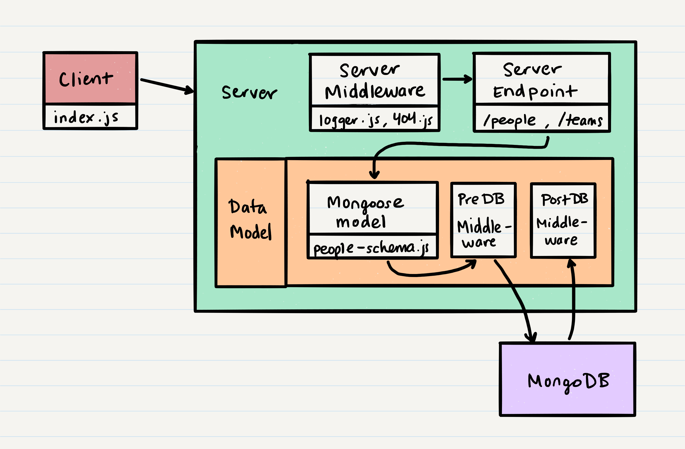

# Class 09 - API Server

| [Lecture Video](https://frontrowviews.com/Home/Event/Play/5d8e8679bdb995374c44c837) | [Lab Video](https://frontrowviews.com/Home/Event/Play/5d8e8552bdb995374c43361c) |
| ----------------------------------------------------------------------------------- | ------------------------------------------------------------------------------- |


## Key Terms

| Term              | Definition | Supporting Links |
| ----------------- | ---------- | ---------------- |
| Middleware        | --         | --               |
| Document / Record | --         | --               |
| Collection        | --         | --               |
| Mongoose          | --         | --               |
| Virtual Property  | --         | --               |
| Pre Hook          | --         | --               |
| Post Hook         | --         | --               |

## Stacks and Queues

During this class, we will also be covering stacks and queues as part of our Data Structures and Algorithms curriculum. You can find more information about stacks and queues [here](../data-structures-and-algorithms/cc-09/resources/stacks_and_queues.md).

## Where We're Coming From

In our last class, we created a fully functioning API server with all the major pieces in place:

- A client that connects to our server
- A server that exposes endpoints for reading and changing data in our database
- Some data models that validate our data operations to ensure they comply with our schema
- A flexible NoSQL database which persists our data

We also learned about how to properly deploy our database from our development environment to our production environment within Heroku. Using the manual commands `mongodump` and `mongorestore`, or by using the tool `mongo-sync`, we can get our local database data pushed to our remote database.

## Where We're Going

In this class, we're going to dive deeper into Mongoose to see how the functionality of this package can make our data models more sophisticated. Primarily, we'll be looking at Mongoose middleware; how to write our own, how to call it, and what existing middleware we might be able to use in our future applications. We'll also be looking at how Mongoose allows us to create virtual properties in our schema; fake key-value pairs that are generated from existing content within our schema.

After our deep-dive into Mongoose, we'll learn of a few more tools and features that can make our code cleaner and better modularized! We'll touch upon testing our connected API Server, and our final task for this class (as defined in the [lab](/lab)), will be to read, interpret, and write tests for a completely new API Server that we haven't built.

> Note: This is very much a real-world example - taking code you haven't written and attempting to interpret it and build upon it.

### Mongoose Review

Before we dive into learning new content, let's take a moment to review the Mongoose package; what it is and why we use it.

[Mongoose](https://mongoosejs.com/) is a data modeling library for MongoDB. Because MongoDB is a NoSQL database, it doesn't have strict data models or schema definitions, and so Mongoose steps in to do that work for us.

Mongoose manages the relationships between data, schema validation, and the translation between raw MongoDB data and JavaScript objects. Let's take a closer look at how we created our schema for our People data model:

```javascript
const mongoose = require('mongoose');

const peopleSchema = mongoose.Schema({
  firstName: { type: String, required: true },
  lastName: { type: String, required: true },
  _team: { type: mongoose.Schema.Types.ObjectId, required: false }
});

module.exports = mongoose.model('people', peopleSchema);
```

After we defined our `people` schema using the Mongoose-specific data types and options, we used a function Mongoose provides called `model`:

```javascript
module.exports = mongoose.model('people', people);
```

What this line is doing is creating a data model from our schema. We haven't really been referring to it as such; instead we've been calling it our schema, and defining our own data model wrapper. But really, the process we go through is more like:

```javascript
// Define schema
const schema = { ... }

// Generate Mongoose Model, where 'myModel' is the name of
// the collection stored in MongoDB
let mongooseModel = mongoose.model('myModel', schema);

// Wrap our Mongoose Model in our own Model
class Model {
  constructor(mongooseModel){
    this.schema = mongooseModel;
  }

  create() {}
  read() {}
  update() {}
  delete() {}
}
```

The reason we have a wrapper model upon the existing model created by Mongoose, is so that we can define our own function names upon our Model, and add to our Model's functions and variables. For example, the Mongoose model has `find`, `save`, `countDocuments`, etc exposed. These are all operations we can do upon our MongoDB database. By creating our wrapper model, we can expand upon this set of functions as much as we want, and we can expose standardized CRUD operations without having to remember their MongoDB counterpart.

This way, a developer who is familiar with a SQL database, or something other than MongoDB, won't have to learn that you need to call `find()` in order to read, or that you need to call `save()` in order to create. Instead, they'll just see familiar CRUD operations exposed, and will know what to do from there.

So, in essence, our `model.js` exists to make our data models more generic and extensible, instead of being directly tied to MongoDB commands.

Now that we're refreshed on Mongoose, let's learn some more functionality upon it. We know where we want to go, so now it's time to figure out...

## How To Get there

### Mongoose Virtual Properties

Virtual properties in Mongoose are new key-value pairs for a data model that don't actually exist in any schema. For example, in our People schema, we had a property `firstName` and a property `lastName`. What if we wanted a property `fullName` that was essentially equal to `firstName + ' ' + lastName`?

If we were to add the property `fullName` to our schema, it would be redundant data that we would need to maintain; every time we changed `firstName` or `lastName`, we would need to update `fullName` to match. Instead, if we use Mongoose virtual properties, we can get our `fullName` key-value pair to not be in our schema, AND we can automatically populate based on the values of `firstName` and `lastName`!

```javascript
peopleSchema.virtual('fullName').get(function() {
  return this.firstName + ' ' + this.lastName;
});

peopleSchema.virtual('fullName').set(function(name) {
  let str = name.split(' ');

  this.firstName = str[0];
  this.lastName = str[1];
});
```

When creating a virtual property, you use the `.virtual` function upon a `mongoose.Schema` object. Then, in order to define what that virtual property value contains, you define a getter and setter function (`.get` and `.set`).

In this case, when we want to get the value of `fullName`, really we're just getting the person's `firstName` and `lastName`, with a space in-between. When we attempt to set someone's `fullName` to something else, really we're wanting to set a new `firstName` and/or `lastName`, so our setter function defines that behavior.

> Note: Don't use arrow (`=>`) functions when defining your getter and setter function, instead use the `function` keyword. This is because arrow functions will no longer have a correct reference to `this`, and you need to use `this` to access the non-virtual key-value pairs such as `firstName`.

Now that we've set our virtual property for the People schema, we can use it in our code:

```javascript
const People = require('./people-model.js');
const people = new People();

people.getFromField({ firstName: 'Sarah', lastName: 'Smalls' }).then(person => {
  person.fullName = 'Sarah Biggs';
  console.log(person);
});
```

This should output something like:

```javascript
{
  _id: "5da55cace347655069b52505",
  firstName: 'Sarah',
  lastName: 'Biggs',
  _team: "5da55b3d8ee0994f61026f6b"
}
```

And thus we have a virtual property: it's not anything that is saved in our database, instead it has a dynamically generated value that we can use in our JavaScript code.

### Mongoose Middleware

We've had some experience with middleware within our servers, and now it's time to dive into the world of Mongoose middleware.

An important thing to note about Mongoose middleware; just like how some of our `server.js` middleware was triggered / called based on what route or endpoint we were requesting, Mongoose middleware is triggered based off of what MongoDB function we're attempting to call. Examples of MongoDB functions are `find()`, `save()`, `deleteOne()`, etc. We will refer to these functions as the Mongoose "endpoints", just as we refer to our `server.js` routes as endpoints.

There are a four kinds of middleware that Mongoose recognizes. For our purposes, we only need to be aware of two:

| Type                | Description                                                                                                                                                                              | Endpoints                                                                                                                                                        |
| ------------------- | ---------------------------------------------------------------------------------------------------------------------------------------------------------------------------------------- | ---------------------------------------------------------------------------------------------------------------------------------------------------------------- |
| Document Middleware | This is a function that will apply to the record you're trying to access within MongoDB. For example, this would be a person or team.                                                    | `validate`, `save`, `remove`, `updateOne`, `deleteOne`, `init`                                                                                                   |
| Query Middleware    | This is a function that will apply to the query you're trying to search for within MongoDB. For example, when we call `find()`, we pass as a parameter a query to filter the records by. | `count`, `deleteMany`, `deleteOne`, `find`, `findOne`, `findOneAndDelete`, `findOneAndRemove`, `findOneAndUpdate`, `remove`, `update`, `updateOne`, `updateMany` |

When we want to write / set middleware for Mongoose, we have to think about where in the client-server chain we want that function to run.

Remember, technically, our database is a server and Mongoose is a client! We've talked a bit before how Mongoose acts as a "middleman" (or middleware) between our `server.js` code and our MongoDB database. But, during the process of Mongoose talking to MongoDB, there can be another group of middleware between that communication chain!



As you can see in the image above, Mongoose actually exposes two points in the "Mongoose client >> MongoDB server" chain we can use in our data model: `pre` and `post`.

#### Pre Middleware

Suppose we want to do something right before Mongoose requests an endpoint such as `find()`, `save()`, etc. For example, in our People schema, what if we were to add a key-value pair that kept track of when the person record was updated?

```javascript
const mongoose = require('mongoose');

const peopleSchema = mongoose.Schema({
  firstName: { type: String, required: true },
  lastName: { type: String, required: true },
  lastUpdated: { type: Date, required: false },
  _team: { type: mongoose.Schema.Types.ObjectId, required: false }
});

module.exports = mongoose.model('people', peopleSchema);
```

One way we could set and maintain the value of `lastUpdated` would be through `pre` middleware that ran every time we called `.save()` or `.updateOne()`:

> Note: `save` and `updateOne` are Document endpoints; when we create middleware for these endpoints and try to access `this` within our middleware function, the `this` refers to the record we are trying to `save` or `updateOne`. In our people example, `this` refers to a person we are trying to `save` or `updateOne`.

```javascript
const updated = function(next) {
  let now = Date.now();

  this.lastUpdated = now;
  next();
};

peopleSchema.pre('save', updated);
peopleSchema.pre('updateOne', updated);
```

> Note: For both pre and post middleware, the function needs a `next` parameter, and it needs to call `next()` at the end of the function.

With this middleware definition, before we request the MongoDB to save or update our record, we will update the record's key `lastUpdated` to be a current timestamp. Remember, this is middleware attached to our schema, so we can define it in the same file we define our schema.

> Note: For both pre and post middleware, define it BEFORE your `mongoose.model` command, otherwise the middleware will not properly work.

#### Post Middleware

If pre middleware happens before the endpoint reaches MongoDB, then post middleware is executed when a response is returned from MongoDB back to Mongoose.

For example, suppose after calling `save`, we wanted to `console.log` a message that we saved correctly. We could do this through the following middleware:

```javascript
const saveLogger = function(next) {
  console.log('Saved Record');
  next();
};

peopleSchema.post('save', saveLogger);
```

#### Document and Query Conflicts

Some endpoints fit in both the document and query middleware sections. How can we differentiate which one is which in our middleware? Remember, in a document endpoint's middleware, `this` refers to a specific record. In a query endpoint's middleware, `this` refers to the query you're searching by.

When there is a document and query conflict, you can specify which one you would like through an object parameter:

```javascript
const removeLogger = function(str) {
  return function(next) {
    console.log(str + ' removal');
  };
};

peopleSchema.post('remove', { document: true }, removeLogger('single record'));
peopleSchema.post('remove', { query: true }, removeLogger('query-based'));
```

### Mongoose Populate

Now that we've had some experience with middleware, let's see how we can better structure our schema so that we can define relations between different models. Again, take a look at our People schema:

```javascript
const mongoose = require('mongoose');

const peopleSchema = mongoose.Schema({
  firstName: { type: String, required: true },
  lastName: { type: String, required: true },
  lastUpdated: { type: Date, required: false },
  _team: { type: mongoose.Schema.Types.ObjectId, required: false }
});

module.exports = mongoose.model('people', peopleSchema);
```

In this schema, `_team` is a reference to a specific team record in the Teams data model. We can specify that this is a reference by using the `ref` key:

```javascript
const peopleSchema = mongoose.Schema({
  firstName: { type: String, required: true },
  lastName: { type: String, required: true },
  lastUpdated: { type: Date, required: false },
  _team: { type: mongoose.Schema.Types.ObjectId, required: false, ref: 'teams' }
});
```

> Note: The value of `ref` has to exactly match a string passed to `mongoose.model()`

What this additional key-value does for us is specify that `_team` must be equal to an id that exists in the Teams collection. It also lets us do something very handy: every time we query for a person, we can run a command that will also automatically query for the team specified by the `_team` key-value.

```javascript
let person = await people.findOne({ firstName: 'Sarah' }).populate('_team');

console.log(person._team.name);
```

By using `.populate(key)`, we can tell Mongoose to replace the id stored at `_team` with the full contents of that team record in the Teams database! Better yet, we can put our `populate` function in some middleware so it's even more seamless:

```javascript
const populateTeam = function(next) {
  this.populate('_team').then(() => {
    next();
  });
};

peopleSchema.post('find', populateTeam);
peopleSchema.post('findOne', populateTeam);
```

### Model-Finder

In your lab for this class, you'll see a new file in the `/middleware` folder, called `model-finder.js`. As with `supertester.js`, you don't need to know the full intricacies of how this works, but we will be covering conceptually what it does.

In our last few labs, we made a lot of routes, some of which were pretty similar. Take a look at the below comparisons, where `model` is a stand-in for either the people or the teams model.

- `GET /people` and `GET /teams` both returned `model.getFromField({})`

- `POST /people` and `POST /teams` both returned `model.create(record)`

- `PUT /people` and `PUT /teams` both returned `model.update(id, record)`

- `DELETE /people` and `DELETE /teams` both returned `model.delete(id)`

- `GET /people` and `GET /teams` both returned `model.getFromField({})`

- `GET /people/:id` and `GET /teams/:id` both returned `model.get(id)`

- `GET /people/count` and `GET /teams/count` both returned `model.count()`

There's a lot of overlap here! What if you wanted to restructure your routes so that the `PUT` and `DELETE` endpoints had an `:id` in their route?

- `PUT /people/:id` and `PUT /teams/:id` both return `model.update(id, record)`

- `DELETE /people/:id` and `DELETE /teams/:id` both return `model.delete(id)`

In order to do this, you would have to update two files and two endpoints, which opens the door for inconsistencies, errors, etc. Since the code between them is essentially the same (the only difference being whether to call `people` or `teams` in place of `model`), let's see if we can prevent ourselves from repeating code.

What if there was a smart "find and replace" for `model`? Depending on the files in our `/model/` directory, it could figure out what `model`'s options are, and then generate routes for each model! Well, that's exactly what `model-finder.js` does.

Now, in our server, we only have to do the following:

```javascript

const express = require('express');
const app = express();
const modelFinder = require(./middleware/model-finder.js);

app.param('model', modelFinder.load);

app.get('/:model', (req, res, next) => {
  req.model
    .getFromField({})
    .then( data => {
      res.send(data);
    })
    .catch(e => { next(e); });
});
```

As you can see, by using `modelFinder.load`, we can replace the `:model` parameter with any of our model names, and (through the `modelFinder.load` middleware) set `req.model` equal to an object from the corresponding model. All the client needs to know is the path `/people` and `/teams` exist. Behind-the-scenes, they share roughly the same code!

> Note: For simplicity, in the code example above we use `app`. You can also use this for your `router`

> Note: While you don't need to know much about the code in `model-finder.js`, line 10 of that file defines how it looks for your models:
>
> ```javascript
> const Model = require(`../models/${modelName}/${modelName}-model.js`);
> ```
>
> You can edit this line to suit the format of your code.

## Summary
