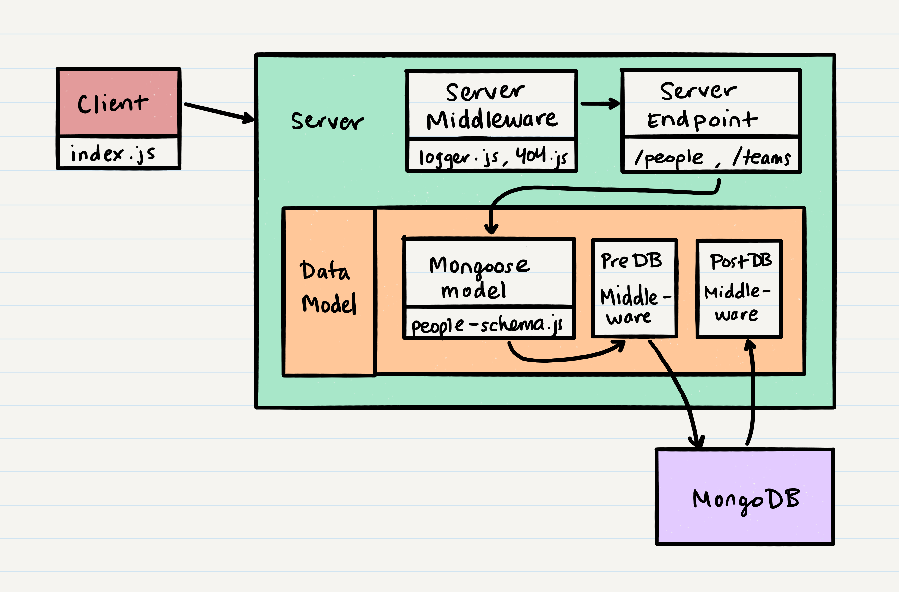

# Class 10 - Authentication

## Key Terms

| Term                          | Definition | Supporting Links |
| ----------------------------- | ---------- | ---------------- |
| Authentication                | --         | --               |
| Authorization                 | --         | --               |
| Encryption                    | --         | --               |
| Hashing                       | --         | --               |
| Salt                          | --         | --               |
| Basic Access Authentication   | --         | --               |
| Cross Origin Resource Sharing | --         | --               |
| Session                       | --         | --               |
| Token                         | --         | --               |

## Key Packages

| Package        | Description | Link                                              |
| -------------- | ----------- | ------------------------------------------------- |
| `cors`         | --          | --                                                |
| `morgan`       | --          | --                                                |
| `jsonwebtoken` | --          | [npm](https://www.npmjs.com/package/jsonwebtoken) |
| `bcrypt`       | --          | [npm](https://www.npmjs.com/package/bcrypt)       |

## Where We're Coming From

In our last class, we continued our learning of API servers, middleware and Mongoose. We saw how Mongoose is actually creating a data model, even though we refer to it as a schema:

```javascript
const mongoose = require('mongoose');

// Our actual 'schema'
const peopleSchema = mongoose.Schema({
    firstName: { type: String, required: true },
    lastName: { type: String, required: true },
    _team: { type: mongoose.Schema.Types.ObjectId, required: false }
});

// Converting that Mongoose schema into a full
// mongoose model with functions and middleware
module.exports = mongoose.model('people', peopleSchema);
```

This model that Mongoose creates has the ability to add virtual key-value pairs that we define using a **getter** and a **setter** function. It also allows us to add middleware that executes _before_ the connection to a database (using `pre` hooks) or middleware that executes _after_ the connection to a database (using `post` hooks).

Overall, in these past few lectures we have learned the basics of:

-   Creating a simple server
-   Adding endpoints or routes to our server
-   Creating middleware for:
    -   Every request on our server using `app.use()`
    -   Requests on specific routes using `router.use()`
    -   Mongoose commands using `pre` and `post`

We have also reinforced the architecture of our application, so that we can paint a mental picture of how requests and responses flow through our clients and servers:



## Where We're Going

Currently, our server exposes endpoints (a.k.a. routes), and these endpoints are available to any client: we can use our `index.js`, we can use [Postman](https://www.getpostman.com/), or we can use some other website or service.

What if our web application had sensitive user data? For example, imagine our `people` model from previous classes stored each person's social security number? We wouldn't want everyone to see this sensitive data just by routing to `/people/:id`.

### CORS

### Authentication and Authorization

Because sensitive data needs to be protected, many web applications have some sense of _authentication_ and _authorization_ built into them:

Authentication is the process of convincing a server that you are who you say you are.

-   Most web applications do this by exposing a `login` or `signin` endpoint, where you provide a username and password in order to gain access to the rest of the web application
-   In order to allow new clients to access secure data, they must first create some authentication credentials using a `signup` endpoint

Authorization is the process of understanding which clients can access which endpoints. After a client is authenticated, they are usually tied to an object in the database that represents them and their permissions. For example after a person logs in, they are tied to a `user` record in the database that has information about their `role` or `permissions`.

-   If you're trying to access the information at `/person/:id`, we check your `user` record to see if your `permissions` allow you to access `/person/:id`
-   If you have the authorization to access the endpoint, the server reaches that endpoint
-   If you don't the server shows you an error

Authentication and authorization (sometimes shortened to Auth/Auth) is the main way that a server can restrict clients from accessing certain routes. This is a hugely important aspect of developing web applications, because web applications manage a lot of data and we need to provide some way to protect that data.

### Protecting Stored Data

Another way we can protect data is through the method of storing it. Most web applications have `user` data, storing the username and password for each person in the users collection. However, if we store everyone's password in a database, then there is a chance that a hacker could get into our database and steal all the passwords.

So, in order to prevent user data from being accessible if a hacker steals user passwords, we want to **encrypt** our passwords. There are two major ways to do this:

-   Two-way encryption using a key
-   One-way encryption using a hash

For example, lets say we had a password "`mypassword`". If we were encrypting it, we would use a key to turn "`mypassword`" into some complicated encrypted string like "`4420d1918bbcf7686defdf9560bb`". We could then later use the same key to reverse "`4420d1918bbcf7686defdf9560bb`" back into "`mypassword`".

If we were to hash "`mypassword`", we would likewise get a complicated encrypted string like "`4420d1918bbcf7686defdf9560bb`", but we would be _unable to reverse the operation_, so we could never return to "`mypassword`".

> "Hashing" refers to the process of turning a string password (also called "plain-text" password) into a hashed password

Because hashing is one-way, it is much more secure than standard encryption. When we want to store sensitive data like passwords in our database, we don't store "`mypassword`", instead we hash it and store "`4420d1918bbcf7686defdf9560bb`". This way, if a hacker gets our data, they have no way of interpreting what the passwords actually are.

When a user attempts to log in, we take their input, hash it, and compare it with our stored hashed password.

#### Salt

Because the same original string results in the same hashed value (`mypassword` will always hash to `4420d1918bbcf7686defdf9560bb`), two individual users that have the same password might have the same _hashed_ password:

| User  | Plain-text Password | Hashed Password in Database  |
| ----- | ------------------- | ---------------------------- |
| Sarah | mypassword          | 4420d1918bbcf7686defdf9560bb |
| Bill  | mypassword          | 4420d1918bbcf7686defdf9560bb |

We want to prevent this where we can, so that everyone has a unique hashed password regardless of if their string password is the same. In order to do this, we use something called "salt" when hashing our password.

A salt is a fixed-length, randomly generated value. The salt is added to the plain-text input of hash functions to create unique hashes for every input, regardless of the input not being unique. So, with salt, we can now get hashed passwords like:

| User  | Plain-text Password | Hashed Password in Database  |
| ----- | ------------------- | ---------------------------- |
| Sarah | mypassword          | 4420d1918bbcf7686defdf9560bb |
| Bill  | mypassword          | 77b177de23f81d37b5b4495046b2 |

Because the salt is unique, we need some way to save the salt for each user. This way, every time that user attempts to login with a password, we find that user's salt, and hash their password entry with that salt, resulting in the same hashed password for the same user. We typically store the salt with the password in the database.

| User  | Plain-text Password | Hashed Password in Database  | Salt     |
| ----- | ------------------- | ---------------------------- | -------- |
| Sarah | mypassword          | 4420d1918bbcf7686defdf9560bb | 42a2bb64 |
| Bill  | mypassword          | 77b177de23f81d37b5b4495046b2 | 371de488 |

This is considered more secure because if a hacker gets access to `4420d1918bbcf7686defdf9560bb`, they might be able to find some way to turn that into Sarah's password `mypassword`, but they wouldn't be able to use that same process to turn `77b177de23f81d37b5b4495046b2` into Bill's password `mypassword`!

Overall, the process of protecting data against attackers is a complicated one! We don't need to know the intricacies of it too much for this class, but it is a good idea to have a general understanding of encryption, hashing and salt. Hashing is also a process used in the data structure called a HashTable, which we will be learning about during Class 26.

For more details about hashing and salt, check out [this great resource](https://auth0.com/blog/adding-salt-to-hashing-a-better-way-to-store-passwords/).

### Sessions and Tokens

So what happens after a client has successfully logged in, verified their password against the hashed password stored in the database, and completed a request?

Well, if that client wants to make another request (maybe load another secure page) they would have to go through the authentication process all over again! This can be very tiresome - imagine every time you went to a new page on Facebook, you had to enter your username and password again.

In order to prevent a previously authenticated client (a logged in user) from having to re-authenticate with every new request, the server can respond to a single authentication with either a session or a token.

#### Session

When a client successfully authenticates (a user successfully logs in) the server saves a session id as a **cookie** on the client. Usually, the client is a web browser, but applications that are clients can have cookies as part of their request object.

> ##### Cookies
>
> A cookie is common term in web applications and web browsing. In essence, a cookie is just some data stored in a file. When a client (such as a web browser) makes a request, the server loads in data from the client's cookie. For more details about cookies and how they work, check out [this explanatory video](https://www.youtube.com/watch?v=I01XMRo2ESg)

The session id doesn't actually save any user data, it's instead something that the server can interpret to find the correctly authenticated user. This means that the server needs to store some table mapping of session ids to users:

| Session Id      | User  |
| --------------- | ----- |
| 42e10395fac3401 | Sarah |
| 2d0a0394bc03e39 | Bill  |

Because the server has to save this information, the server is _stateful_; the server changes based on which clients interact with it. This can be a disadvantage if millions of clients are interacting with a single server!


#### Tokens

Usually, we want our servers to be _stateless_. We don't want our server to change or grow in complexity based on the number of clients it communicates with, because that makes it harder to support millions of clients.

So, tokens are another way to allow a client to remain authenticated through multiple requests. After a client authenticates, a server will generate a token using some user data and a unique **signature**. The server then sends this token to the client. In all future requests, the client must add the received token to their request header.

When a server receives a token from a client, it first checks that the token was not tampered with by verifying the signature. Then, it pulls the user data (usually a user id) from the token and automatically authenticates the client.

This process allows the server to be stateless, because the server isn't changing depending on client requests. When the server creates a token, it uses a secret string to make the token unique to that current server. The token can only be interpreted if you have access to that secret string, so this makes the token secure enough to be sent to the client.


### Summary

So far, we've covered a wide range of topics:

-   Authentication: Is the client who they say they are?
-   Authorization: Is the client allowed to access this data?
-   Hashing: A one-way conversion from plain-text string to an protected hashed string
-   Sessions and Tokens: How a previously authenticated client can maintain its authentication over multiple requests

All of these topics involve creating a secure connection between a client and server. Individually, these topics have a lot of complexity and are constantly evolving as hackers find new ways to steal data. In this class, we're going to learn about a few standard methods to make our application data secure, so that we can get started with managing users and user data!

Here's an overview of the application data flow we'll try to achieve:


## How To Get There

### Creating a User

First, we need to build a model that represents a valid user / client in our application. We can do that easily just as we have been doing for our `People` and `Teams` models:

```javascript
const userSchema = mongoose.Schema({
    username: { type: String, required: true, unique: true },
    password: { type: String, required: true }
});

module.exports = mongoose.model('users', userSchema);
```

Now, if we were to leave this as it is defined above, we would have a problem: when we create a user, we would be storing the plain-text password instead of the hashed password!

To fix this, we want to ensure that before we save our user to the database, we take some time to hash the password, and then save the hashed value to the database instead of the original plain-text password. We can do this easily using the `pre` middleware hook for the Mongoose `save()` function:

```javascript
const userSchema = mongoose.Schema({
    username: { type: String, required: true, unique: true },
    password: { type: String, required: true }
});

userSchema.pre('save', async function() {
    this.password = await bcrypt.hash(this.password, 10);
});

module.exports = mongoose.model('users', userSchema);
```

> Remember: any middleware we define must be written BEFORE we call `mongoose.model`.

In this above example, we're using a new package, called [`bcrypt`](https://www.npmjs.com/package/bcrypt). This package makes it effortless for us to create a hashed password by using the `hash()` function:

```javascript
/*
 * Function bcrypt.hash takes a plain-text password and turns it
 * into a hashed string.
 * @param {String} password - The plain-text password that you want to hash
 * @param {Number} saltRounds - The complexity of the salt (we usually use 10)
 * @return {Promise<string>} - The hashed password
 */
let hashedPassword = await bcrypt.hash(originalPassword, saltRounds);
```

Once we've created a hashed password, we can actually override the existing user's password with the new hashed value! This makes us doubly sure we're not saving the plain-text password anywhere.

> #### But What about the Salt?
>
> Interestingly, when we use `bcrypt`, we don't need to manually generate or store the salt. `bcrypt` automatically generates the salt and stores it within the hashed password. To learn more about how `bcrypt` works, check out [this link](https://auth0.com/blog/hashing-in-action-understanding-bcrypt/)

So now, we've collected a username and password from a client, ran some hashing middleware before saving it to the database, and then finally saved the username and hashed password as a new user in our database.

### Generating a Token

We're almost done with our process. Our client has signed up (and therefore authenticated), and now we want them to remain authenticated as they continue to make requests. So, we need to give them a token that they can use to auto-authenticate in future requests.

We can generate tokens using another package, [`jsonwebtoken`](https://www.npmjs.com/package/jsonwebtoken). We want to generate this token after our user has been saved to the database. So, we can either do it in a `post` middleware function, or we can create a function on the user model that our server can then call:

```javascript
const jwt = require('jsonwebtoken');

...

userSchema.methods.generateToken = function() {
    let tokenData = { id: this._id ;

    return jwt.sign(tokenData, process.env.JWT_SECRET);
};
```

```javascript
app.get('/signup', async (req, res, next) => {
    let user = userModel.create(req.body);
    let token = user.generateToken();

    res.set('token', token);
    res.send('Successfully signed up!');
});
```

Mongoose allows us to add functions on the record and model level using `methods` and `statics`. A function on the record level will be accessible for every record in our database, and these functions are defined using the `methods` keyword upon the schema.

Similarly, a function on the model level can be used akin to functions like `.save()` or `.find()`; these functions are defined using the `statics` keyword upon the schema.

The `jsonwebtoken` function `.sign()` builds a token for us using some data we want to preserve that will help us authenticate (in this case, the id of the recently created and authenticated user). The `.sign()` function also encrypts that data using a `secret` - a simple string that is unique to our application, and which is usually defined in our environment variables.

```javascript
/*
 * Function jwt.sign takes an object with data and a secret string
 * and generates a unique token.
 * @param {Object} tokenData - Some data to quickly identify the user
 * @param {String} secret - A unique string used for encryption
 * @return {String} - The generated token with the data, a signature and
 * some expiry time for when the token is no longer valid
 */
let token = jwt.sign(tokenData, secret);
```

## Summary
