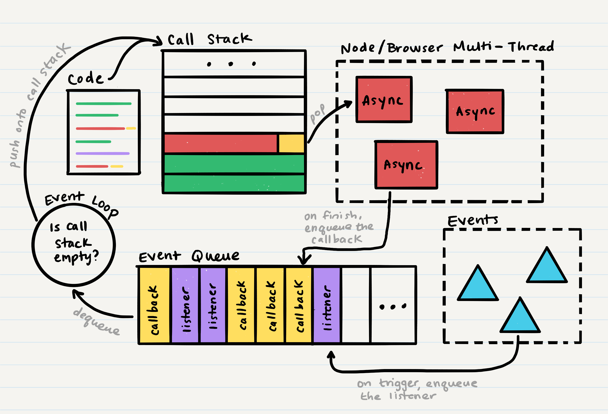

# Class 15 - Event Driven Applications

| [Lecture Video](https://frontrowviews.com/Home/Event/Details/5d8e8679bdb995374c44c858) | [Lab Video](https://frontrowviews.com/Home/Event/Details/5d8e8552bdb995374c433638) |
| -------------------------------------------------------------------------------------- | ---------------------------------------------------------------------------------- |


## Key Terms

| Term                     | Definition                                                                                                                                                                                                                                                                                                                                                                    | Supporting Links                                                                                                                                                                                                                                        |
| ------------------------ | ----------------------------------------------------------------------------------------------------------------------------------------------------------------------------------------------------------------------------------------------------------------------------------------------------------------------------------------------------------------------------- | ------------------------------------------------------------------------------------------------------------------------------------------------------------------------------------------------------------------------------------------------------- |
| Observer Pattern         | This is a software design pattern where an object, called the _subject_ has a list of _observers_ that are notified when something about the _subject_ changes. Events follow the Observer Pattern.                                                                                                                                                                           | [1](https://www.dofactory.com/javascript/observer-design-pattern) / [2](https://en.wikipedia.org/wiki/Observer_pattern)                                                                                                                                 |
| Events                   | Events are actions within our application ecosystem that are "raised" or "triggered" either manually within a function, by some user input, or by connections to other services.                                                                                                                                                                                              | [1](https://www.techopedia.com/definition/3359/event) / [2](<https://en.wikipedia.org/wiki/Event_(computing)>)                                                                                                                                          |
| Listeners                | A listener continually waits for a specific event to be raised, and then executes some code (a handler) each time the event is raised.                                                                                                                                                                                                                                        | [1](https://www.computerhope.com/jargon/e/event-listener.htm) / [2](https://blog.kotlin-academy.com/programmer-dictionary-event-listener-vs-event-handler-305c667d0e3c)                                                                                 |
| Event Handler            | An event handler is the code that executes after an event is raised. An event listener will then acknowledge that the event was raised and call an event handler. The content of an event handler can be anything specific to the application and event.                                                                                                                      | [1](https://searchapparchitecture.techtarget.com/definition/event-handler) / [2](https://www.webopedia.com/TERM/E/event_handler.html) / [3](https://blog.kotlin-academy.com/programmer-dictionary-event-listener-vs-event-handler-305c667d0e3c)         |
| Event Driven Programming | This is an approach to programming where code emits events instead of using callbacks. While event driven applications can use both events and callbacks in conjunction, this style of programming generally places a preference on emitting events.                                                                                                                          | [1](https://www.computerhope.com/jargon/e/event-driven-prog.htm) / [2](https://medium.com/@vsvaibhav2016/introduction-to-event-driven-programming-28161b79c223) / [3](https://en.wikipedia.org/wiki/Event-driven_programming)                           |
| Event Loop               | The event loop is a continually running process in every application that checks whether the call stack is empty. When the call stack is empty, the event loop pushes the front of the event queue onto the call stack, and then repeats the process of checking for an empty call stack. Through the event loop, programs can have asynchronous processes and event handling | [1](https://flaviocopes.com/node-event-loop/) / [2](https://nodejs.org/de/docs/guides/event-loop-timers-and-nexttick/) / [3](https://blog.logrocket.com/a-complete-guide-to-the-node-js-event-loop/) / [4](https://www.youtube.com/watch?v=8aGhZQkoFbQ) |
| Event Queue              | The event queue exists throughout the lifetime of your application, and it enqueues callback functions and listeners that need to be run in the call stack. The event queue enqueues these callbacks and listeners when an asynchronous operation ends, or when an event is triggered.                                                                                        | [1](https://www.techopedia.com/definition/24963/event-queue) / [2](https://gameprogrammingpatterns.com/event-queue.html)                                                                                                                                |

## Key Packages

| Package  | Description                                                                                | Link                                        |
| -------- | ------------------------------------------------------------------------------------------ | ------------------------------------------- |
| `events` | This is the main Node module for creating and managing events (and event listeners)        | [npm](https://www.npmjs.com/package/events) |
| `fs`     | This is the main Node module for managing file operations such as read, write, create, etc | [NodeJS](https://nodejs.org/api/fs.html)    |

## Where We're Coming From

Our last class was a large-scale review of APIs and how they are built with routes, authentication, authorization and data management. We should now have a good understanding of the _Web Request Response Cycle_ - clients make HTTP requests to server endpoints, and these endpoints send responses back to the client.

Now, we're going to take a step away from client-server interactions towards a more broader programming concept: events and listeners.

## Where We're Going

Many of you might have some familiarity with the term **_event_**. It is very commonly used in HTML and JavaScript when buttons are clicked or when items on the page are interacted with. Here's an example of how a JavaScript event might be set up:

```html
<form onsubmit="handleSubmit(event)"></form>
```

```javascript
function handleClick(event) {
  event.preventDefault();

  let data = event.target[0].value;
}
```

Here, our form will raise an event whenever it is submitted, and it will assign a `onSubmit` **_listener_**, which will handle the form submission with an **_event handler_** called `handleSubmit`. The `handleSubmit` function will be given all the event details, and can then access data or methods within the event object in some unique way.

You may have also used events, listeners and handlers in JavaScript when attempting to execute some code when the `window` or `document` changes:

```javascript
window.addEventListener('resize', function() {
  console.log('I am resizing the page!');
});
```

Here, you're asking to add a listener for an event that the window will "raise" or "trigger" when we attempt to resize the window.

So as you can see, events and listeners are very common in programming, and you've already had some familiarity with them before. Now, we're going to learn how to raise events and define listeners in our Node back-end.

### The Event Loop

Before we dive into how to write our own events, let's take a moment to learn a bit more about how events actually work. When we talked about asynchronous code in [Class 03](../class-03/README.md), we mentioned the idea of a _main event loop_.



When you run your application, each line of your code starts by being pushed onto a _call stack_. When this line of code is done executing, it is popped off of the stack.

For asynchronous lines of code, (for example getting data from a database, setting a timeout, reading a file, etc.), they also start by being pushed onto the call stack. However, since they can take an unknown amount of time and we don't want our application to be on pause until it's done, JavaScript immediately pops these asynchronous lines of code off of the call stack and onto a separate _thread_. Before popping, our code usually sends along a _callback_ to be run after the asynchronous command is complete.

> A thread is an external process that can execute code. When you run your applications on a browser, the browser creates new threads. When you run you application in your terminal, Node creates new threads.

When the asynchronous command is complete, the callback is pushed onto another data structure called the **_event queue_**. There is a continuous process that runs outside of our application called the **_event loop_**. The event loop's sole job is to dequeue things from the event queue, and push them onto the call stack **only when the call stack is empty**. We call it an event loop because it is always checking on the status of the call stack while the application runs (it is looping the same operation `is call stack empty`).

Now, how do events fit into this? Well, we've been calling it the event queue and the event loop, so clearly they must work together in some way. And they do!

Events can be triggered by code in our application, by the ecosystem our application is running in, and more. When an event is triggered, it searches our code for any listeners attached to that specific event. Then, those listeners are enqueued onto the event queue, just like asynchronous callbacks!

> In our code, we can register new events that the system will keep track of. We can also register as many listeners for as many events as we want.

So now that we have a better idea of how events are handled by the application ecosystem, let's figure out how to create our own events and event listeners!

## How To Get There

### EventEmitter Class

Events and event listeners are handled by the Node `events` module. Like the file system module `fs`, this module is built into Node and does not need to be installed. Instead, to use it, you just need to require the module in your code:

```javascript
const EventEmitter = require('events');
```

As you can see, when we require the events module, what we get is an exported class called `EventEmitter`. When we think of the term "emit", we should think of an event being "raised" or "triggered". So, this class allows us to both raise new events and to listen to events that have been raised. In order to use this class, we need to create an object from it:

```javascript
const emitter = new EventEmitter();
```

Now that we have an `emitter`, we can start by creating some events and listeners. One thing to note is that order of definition is important; if an event is triggered before we assign its listener, then the listener will never be called.

```javascript
function myEventHandler() {
  console.log('I am handling my event!');
}

function willNotHit() {
  console.log('I will not print this');
}

emitter.on('my-event', myEventHandler);
emitter.emit('my-event');

emitter.on('my-event', willNotHit);
```

Here, we're using two new functions from the `EventEmitter` class, `on` and `emit`.

The `on` function defines a listener for an event, with the first parameter being the name of the event, and the second parameter being a callback for when the event is raised.

The `emit` function tells us to raise an event. It usually takes one parameter, which is the name of the event we want to raise. You can add additional parameters which represent arguments that will be passed to any attached listeners. Typically, we want to raise an event after we've done something, instead of just randomly in our code. So, you'll usually see `emit` calls within functions that complete a specific action.

In this example `willNotHit` is never entered because this listener was defined after the event was already raised. If we add a subsequent event `emit` after the `willNotHit` listener is defined, we will get to enter `willNotHit`!

### Key Functions

We used `on` and `emit` in our example above, but there are some other very useful `EventEmitter` functions to be aware of. Here is a subset of those functions, but you can find the full list [here](https://nodejs.org/api/events.html#events_event_removelistener).

| Function    | Description                                                                                            | Example Usage                                    |
| ----------- | ------------------------------------------------------------------------------------------------------ | ------------------------------------------------ |
| `on`        | Defines a listener for an event                                                                        | `emitter.on(<event name>, <callback>);`          |
| `off`       | Removes a listener for an event                                                                        | `emitter.off(<event name>, <callback>);`         |
| `emit`      | Raises an event                                                                                        | `emitter.emit(<event name>);`                    |
| `emit`      | Raises an event and passes arguments to any attached listeners                                         | `emitter.emit(<event name>, <event arguments>);` |
| `once`      | Defines a listener that only runs _the first time_ an event is raised. After that, it never runs again | `emitter.once(<event name>, <callback>);`        |
| `listeners` | Returns the listeners (as an array of functions) attached to a specified event                         | `emitter.listeners(<event name>);`               |

### Event-Driven Applications

Aha! We've reached the title of this class. What do we mean when we say "event-driven applications?". Typically this refers to a method of developing your application so that instead of sending a bunch of callback functions, you create events and listeners. The benefit of this approach is that now you can have multiple listeners on a single event - having multiple callbacks however is harder to do and can quickly get very confusing.

Event listeners are executed in the order that they're defined, so you can do the equivalent of multiple callbacks (or multiple functions in a Promise) with events:

```javascript
function executeCallBack(callback) {
  console.log('Executing');
  callback();
}

function executeEvent(callback) {
  console.log('Executing');
  emitter.emit('executed');
}

function first() {
  console.log('I am first!');
}

function second() {
  console.log('I am second!');
}

// Callback example
executeCallback(() => {
  first();
  second();
});

// Event example
emitter.on('executed', first);
emitter.on('executed', second);
```

Another benefit of event driven applications is _decoupling_ our responses to actions. When we have a callback structure, every time we do an action, all the responding callbacks need to be imported or defined in the same file. We also need to call them in a specific order each time.

For events, it doesn't matter where you emit them; they will search our whole application for listeners. You really don't even need to worry about the listeners! The listeners don't have to be imported into each file that emits an event, and they never are called directly. This can be very useful for large and complex applications.

> Note, one thing that you do need in order for this process to work is a single `EventEmitter` object across your entire application. This is usually handled by creating a module file that exports the `EventEmitter` object, and requiring that in every file where you emit and event or assign a listener.

## Summary

Events can be a powerful new way to respond to actions within your application. Generally, they're not much different than callbacks or Promise `.then()`. Events just add more flexibility and work well with increasing application complexity.

You can use events by creating an object from the Node `EventEmitter` class, and you create events using `emit` and listen to events using `on`. Events are used by a lot of modules and processes, including HTTP requests, express, and more. We'll be spending the next two classes learning more applications of events!
