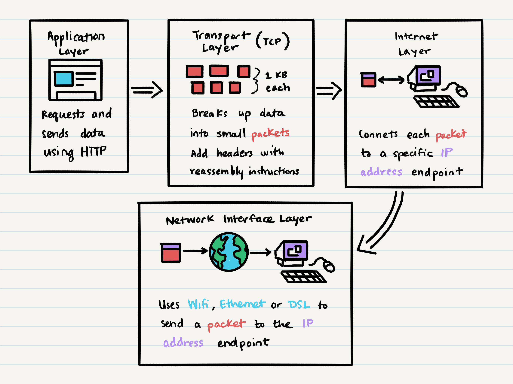

# Class 16 - TCP Server

| [Lecture Video]() | [Lab Video]() |
| ----------------- | ------------- |


## Key Terms

| Term                    | Definition | Supporting Links |
| ----------------------- | ---------- | ---------------- |
| TCP                     |            |                  |
| UDP                     |            |                  |
| Packets                 |            |                  |
| OSI Model               |            |                  |
| Internet Protocol Suite |            |                  |
| Buffered Transfer       |            |                  |
| Stateful Networking     |            |                  |

## Key Packages

| Package | Description | Link |
| ------- | ----------- | ---- |
| `net`   |             |      |

## Where We're Coming From

In our last class, we learned how to create events within our application and raise or "emit" them whenever we need to. This is a great way to have global responses to actions within our application, or to handle asynchronous operations easily without the use of callbacks or Promises. The Node `EventEmitter` class is our gateway to emitting events and listening for events.

Our last lab tackled application-wide events; events that are completely owned, emitted and handled by one application's code. Now, we're going to branch out into cross-application events. We'll learn about ways to connect to other running applications and listen for events raised by them.

## Where We're Going

In this class, we'll be primarily learning about **_TCP_** connections. TCP stands for Transmission Control Protocol, and it is an internet standard that defines how two applications can exchange data over a network.

You may be thinking "Isn't this what HTTP does?". HTTP is also a protocol (the Hypertext Transfer Protocol) and it is also a way for applications to exchange data. Our GET, POST, PUT, DELETE commands are what allowed us to exchange data between web servers and any application (Node application, Postman, HTTPie, etc.), so what makes that different from TCP?

To get the answer, we'll need to take some time to understand all the processes that go into data transfer over the internet.

### How Internet Data Transfer Works

Internet data transfer is usually a series of steps, where each step follows a _protocol_. Remember, a protocol is really just a set of rules or guidelines for how to do something. There are multiple internet protocols out there, and new ones are being developed as well!

So, we have the idea of individual protocols (rules on how to do a specific thing), and then a collection of protocols executed in a particular order. This collection is usually referred to as an **_Internet Protocol Suite_**. Let's take a look at some Internet Protocol Suite examples:

#### TCP/IP Protocol Architecture Model

By far one of the most common protocol collections, this model specifies four major steps for transferring data from one application to another.



Let's break down each step with a little more detail:

| Layer          | Description                                                                                                                                                                                                                                                                                                         | Protocol Examples     |
| -------------- | ------------------------------------------------------------------------------------------------------------------------------------------------------------------------------------------------------------------------------------------------------------------------------------------------------------------- | --------------------- |
| Application    | User action or application action initiates some data transfer (either a request or a response). Data asks to be sent from the current application (origin) to another URL (endpoint).                                                                                                                              | HTTP, SMTP, FTP, DHCP |
| Transport      | The data that is being sent from origin to endpoint is broken up into small **_packets_** of 1 Kilobyte each. This makes it easy to send data quickly and efficiently. When the data is broken up into packets, each packet gets a header that specifies how to reassemble the packets into the original full data. | TCP, UDP, µTP         |
| Internet       | Individual packets are then marked with the endpoint's IP address. This is a more detailed location than a simple URL. Now that the packets are marked with where they should go, packets can be sent individually instead of as a group.                                                                           | IPv4, IPv6, ICMP      |
| Network / Link | The network takes any random collection of packets from any data transfer requests. It checks each packet's IP address and finds a route over the internet to quickly get that packet to the right endpoint.                                                                                                        | WiFi, DSL, Ethernet   |

We've mostly been working with the first step, the **_Application Layer_**. By using HTTP requests, we don't have to worry about managing the remaining steps; data is funneled through those steps automatically.

However, applications can still transfer data without using HTTP! Instead they can hook into the TCP layer directly. Back-end servers will often do this when communicating with other servers in a network. This is the main difference between HTTP and TCP; both are part of the process to exchange data between two applications / devices / servers, however HTTP is higher up in the chain than TCP.

#### Open Systems Interconnect (OSI) Reference Model

While the TCP/IP Protocol Model is very common, another model adds more layers in between. The OSI model has a total of seven layers instead of four. While not every layer is used in every data transfer, the OSI model is a more comprehensive overview of every possible type of data transfer on the internet.

This is why the OSI model can be a very helpful point of reference. Here's an overview of all seven OSI model layers:

| #   | Layer        | Description                                                                                                                                                                                                                                                                                                                                                                                                  | Protocol Examples                     | Notes |
| --- | ------------ | ------------------------------------------------------------------------------------------------------------------------------------------------------------------------------------------------------------------------------------------------------------------------------------------------------------------------------------------------------------------------------------------------------------ | ------------------------------------- | ----- |
| 7   | Application  | User action or application action initiates some data transfer (either a request or a response). Data asks to be sent from the current application (origin) to another URL (endpoint).                                                                                                                                                                                                                       | HTTP, IMAP, POP, SSH                  |       |
| 6   | Presentation | Before data is sent, we need to make sure it looks correct so that it can be understood by anyone. In this step, data is encrypted, encoded, compressed or transformed to make it easier to transfer.                                                                                                                                                                                                        |                                       |       |
| 5   | Session      | Before data is sent, we need to make sure that we are able to connect to the endpoint. This step attempts to establish a connection with the endpoint using any required credentials                                                                                                                                                                                                                         |                                       |       |
| 4   | Transport    | The data that is being sent from origin to endpoint is broken up into small **_packets_** of 1 Kilobyte each. This makes it easy to send data quickly and efficiently. When the data is broken up into packets, each packet gets a header that specifies how to reassemble the packets into the original full data.                                                                                          | TCP and UDP                           |       |
| 3   | Network      | Individual packets are then marked with the endpoint's IP address. This is a more detailed location than a simple URL. Now that the packets are marked with where they should go, packets can be sent individually instead of as a group. The Network layer also determines the best routes for each packet to use when traveling from origin to endpoint.                                                   | IP and ICMP                           |       |
| 2   | Data Link    | The most complex of the layers, this layer handles the actual bit-by-bit transmission of data from the origin to the endpoint.                                                                                                                                                                                                                                                                               | Ethernet and IEEE 802.11 wireless LAN |       |
| 1   | Physical     | This layer is the actual physical device that is receiving or sending data. This could be a modem that is maintaining your WiFi connection, an Ethernet cord plugged into your machine, a Bluetooth device that is receiving data, etc. Any issues in these physical cables or devices can interrupt the data transfer. This is why there is the famous phrase "have you tried turning it off and on again?" |                                       |       |

Again, the OSI model is very detailed, but not each level is hit during every data transfer. For example, if you initiate a data transfer using HTTP, the presentation and session levels are skipped because that is already handled by the application (remember our `auth` file with encoding, encrypting and token checking?). This model is meant as a standard procedure, but there are exceptions to these standards.

### Transport Layer - TCP Versus UDP

As the title of this class suggests, we're going to be focusing on the transport layer (using the TCP/IP model) for this lecture and lab. This is because we're going to learn how to transfer data when we don't have an application layer.

The transport layer can use any transport-specific protocol, but the most common protocols are TCP and UDP. Remember, the transport layer breaks data into tiny packets, and then adds a header to each packet describing how the packets should be reassembled.

The major difference between TCP and UDP is within the header added to each package. TCP supports a lot of features / information to be stored in the header, while UDP is much more lightweight. Here's a break down of each protocol's header structure:

#### TCP Headers

TCP headers are typically at least 20 bytes (or 160 bits) long, and they contain the following information:

| Position  | Length in Bits | Name                                   | Description                                                                                                                                                                                                                                                                                                   |
| --------- | -------------- | -------------------------------------- | ------------------------------------------------------------------------------------------------------------------------------------------------------------------------------------------------------------------------------------------------------------------------------------------------------------- |
| 0-15      | 16             | Source port                            | This is a port address for the origin _application_. We are familiar with IP addresses, which is an address for a _device_. Multiple applications can run on a device, and each runs on a specific Port. The source port number typically ranges from 1024-65535 (we run our localhost applications on 3000). |
| 16-31     | 16             | Destination port                       | This is a port for our destination application, and it usually is a well known number in the range of 0 - 1023. For example, most website applications using HTTP run on port 80.                                                                                                                             |
| 32 - 63   | 32             | Sequence number                        | This is a value used to keep track of all the packets in the data, and to figure out how to reassemble the packets in the correct order.                                                                                                                                                                      |
| 64 - 95   | 32             | Acknowledgment number                  | This is the sequence number for the next packet in the correct packet assembly order. Usually, this is just the sequence number plus one.                                                                                                                                                                     |
| 96 - 99   | 4              | Data offset                            | This indicates the length of the TCP header so we know when the header ends and the packet contents begins.                                                                                                                                                                                                   |
| 100 - 102 | 3              | Reserved value                         | This is a reserved collection of bits in the header that we never modify; they are usually just three bits set to 0                                                                                                                                                                                           |
| 103       | 1              | `NS` flag                              | An experimental feature for a _nonce sum_: a random cryptographic number used to prevent people from lying about who they are. Most of the time, this flag is unused and set to 0                                                                                                                             |
| 104       | 1              | `CWR` flag                             | Used to mark that a previous packet had its `ECE` flag set.                                                                                                                                                                                                                                                   |
| 105       | 1              | `ECE` flag                             | Typically used to mark that the current packet was hit with network congestion / slowdown.                                                                                                                                                                                                                    |
| 106       | 1              | `URG` flag                             | This is an urgent pointer. When this flag is set to true, the current packet should be treated as a higher priority over other data.                                                                                                                                                                          |
| 107       | 1              | `ACK` flag                             | This flag specifies that the acknowledgment number field is set, meaning that there are more packets to fetch for this data                                                                                                                                                                                   |
| 108       | 1              | `PSH` flag                             | This flag specifies that, if true, the current packet should be transmitted immediately, without waiting for other packets to load.                                                                                                                                                                           |
| 109       | 1              | `RST` flag                             | While not commonly used, this flag when set as true notifies the endpoint to terminate the data connection after it receives the current packet. This is only used when there are unrecoverable errors and it’s not a normal way to finish the TCP connection.                                                |
| 110       | 1              | `SYN` flag                             | This flag indicates if this is the first packet in the data stream.                                                                                                                                                                                                                                           |
| 111       | 1              | `FIN` flag                             | This flag indicates if this is the last packet in the data stream. Indicates that after receiving this packet, we should close the connection.                                                                                                                                                                |
| 112 - 127 | 16             | Window size                            | This specifies how many bytes the endpoint receiver is willing to receive. This is to ensure that we're not sending data that is too large for the endpoint to handle.                                                                                                                                        |
| 128 - 143 | 16             | Checksum                               | This is a generated value that verifies that the TCP header is of the correct format and doesn't have an dangerous content                                                                                                                                                                                    |
| 144 - 159 | 16             | Urgent Pointer (if `URG` flag is true) | If the `URG` flag is set, this data is used to determine where the urgent data ends                                                                                                                                                                                                                           |
| 160 - ... | variable       | Additional options                     | This field is optional and can be anywhere from 0 to 320 bits.                                                                                                                                                                                                                                                |

#### UDP Headers

UDP stands for User Datagram Protocol. This transfer layer protocol is a lot more lightweight than TCP, and, unlike TCP, UDP is _connectionless_. This means that UDP does not establish a secure connection with the endpoint before receiving data. As far as UDP is concerned, it doesn't care if the packets were properly received, it just sends them out. Conversely, TCP maintains a connection to check if the packets were successfully received by the endpoint.

Because UDP is simpler and connectionless, there are fewer items in a UDP header:

| Position | Length in Bits | Name             | Description                                                                                                                                                                                                                                                                                                   |
| -------- | -------------- | ---------------- | ------------------------------------------------------------------------------------------------------------------------------------------------------------------------------------------------------------------------------------------------------------------------------------------------------------- |
| 0-15     | 16             | Source port      | This is a port address for the origin _application_. We are familiar with IP addresses, which is an address for a _device_. Multiple applications can run on a device, and each runs on a specific Port. The source port number typically ranges from 1024-65535 (we run our localhost applications on 3000). |
| 16 - 31  | 16             | Destination port | This is a port for our destination application, and it usually is a well known number in the range of 0 - 1023. For example, most website applications using HTTP run on port 80.                                                                                                                             |
| 32 - 47  | 16             | Length           | This indicates the length of the UDP header and the UDP data.                                                                                                                                                                                                                                                 |
| 48 - 63  | 16             | Checksum         | This is a generated value that verifies that the TCP header is of the correct format and doesn't have an dangerous content                                                                                                                                                                                    |

## How To Get There

Now that we know more about data transfer the the TCP process of breaking up data into packets, let's see how we can create applications that communicate with each other via TCP.

### Using the `net` Module

In order to make TCP data transfer connections, we will be using a built-in Node module called `net`. Like `fs` and `events`, this module does not need to be installed, but does need to be required at the top of your code:

```javascript
const net = require('net');
```

Using `net`, we will be making a TCP **_server_** and multiple **_socket connections_**.

### TCP Server

Our TCP server will manage all connections and receive inbound data. It will then broadcast events which any connections will be able to read and handle. These are the major processes a TCP server will undergo:

-   Will run continuously on a port
-   Will manage connections by having a _pool_ of sockets
-   Will remove sockets from the pool when the connection ends
-   Whenever it receives data, it will check if the data is an event, and then "broadcast" those events to all connected sockets

We can create a TCP server using the `net` module easily:

```javascript
const server = net.createServer();
```

Now, our `server` will have access to a lot of different functions, some of which may be familiar from our time with `express` and `events`.

```javascript
// Starts the server, telling it to being on a certain port
server.listen(port, () => {
    console.log('Server running on Port:', port);
});

// Listen for a built-in 'connect' event (provided by the `net` module)
server.on('connection', socket => {
    console.log('Connection event raised!');
});
```

As you can see, we have access to the `listen` function, and the `on` event listener function. This means that bundled into our server we have the ability to raise and listen to events. There are a few useful built-in events that we can listen to:

| Event          | Description                                                                                                                                 |
| -------------- | ------------------------------------------------------------------------------------------------------------------------------------------- |
| `'listening'`  | Emitted when the server has been bound after calling `server.listen()`                                                                      |
| `'connection'` | Emitted when a new connection is made. A parameter representing the newly connected Socket (`net.Socket`) is available to the event handler |
| `'close'`      | Emitted when the server closes and all connections have ended                                                                               |
| `'error'`      | Emitted when an error occurs - The `'close'` event will be called directly following this event                                             |

Within our TCP server, we should have some collection of all the connected sockets. This is referred to as a _pool_, and it is typically just an array or an object:

```javascript
let socketPool = [];

server.on('connection', socket => {
    socketPool.push(socket);
});
```

### TCP Sockets

Of course, when we have an endpoint or a receiver, we also need need to have an origin or a sender. In our TCP system, these origins are called sockets. We can create them in our applications using the `net` module:

```javascript
const socket = new net.Socket();
```

In order to connect our socket to our TCP server, we need to call the `connect()` method, passing information about the server:

```javascript
socket.connect(
    {
        port: 3000,
        host: 'localhost',
    },
    () => {
        console.log('Connected to server!');
    },
);
```

Once you have a socket, you can also do event operations upon that socket using `on()`. The following events are available for sockets:

| Event       | Description                                                                                                                                                                                 |
| ----------- | ------------------------------------------------------------------------------------------------------------------------------------------------------------------------------------------- |
| `'lookup'`  | Emitted after the socket has verified the connection, but not actually connected                                                                                                            |
| `'connect'` | Emitted when a socket connection is successfully established                                                                                                                                |
| `'data'`    | Emitted when socket receives data. This event sends a parameter to any handlers, which is the received data as a buffer or a string. Encoding of this data is set by `socket.setEncoding()` |
| `'end'`     | Emitted when the socket connection is closed                                                                                                                                                |
| `'timeout'` | Emitted if the socket times out from inactivity. This is only to notify that the socket has been idle. The user must manually close the connection.                                         |
| `'error'`   | Emitted when an error occurs - The `'close'` event will be called directly following this event                                                                                             |
| `'close'`   | Emitted once the socket is fully closed. This event sends a parameter called `had_error` which is a boolean indicating if the socket was closed because of an error.                        |

### Sending Data

A TCP server can send data to sockets by accessing the `.write` function upon any socket in its pool:

```javascript
let socket = socketPool[0];

socket.write('I am sending a message from the server to the socket');
```

The individual socket can then handle the data by having a `'data'` event listener:

```
socket.on('data', data => {
  console.log('Received: ', data);
});
```

And that's about it! As simple as that, we can have independent applications share data and events WITHOUT using HTTP. We're able to skip the application layer and move directly into the transport layer, thereby removing the need for our servers to build HTTP layer configurations.

### Example TCP Connection

Here's a full example of two applications talking to one another via TCP:

#### TCP Server

```javascript
const net = require('net');
const server = net.createServer();

let port = 3000;
server.listen(port, () => console.log(`Server up on`, port));

let socketPool = [];

server.on('connection', socket => {
    socketPool.push(socket);

    let index = socketPool.length - 1;
    socket.on('close', () => {
        socketPool = socketPool.splice(index, 1);
    });

    socket.write('Sample data to send');
});
```

#### TCP Socket

```javascript
const net = require('net');
const socket = new net.Socket();

socket.connect(
    {
        port: 3000,
        host: 'localhost',
    },
    () => {
        console.log('Connected to server');
    },
);

socket.on('data', data => {
    console.log('Received data: ', data);
});
```

## Summary
