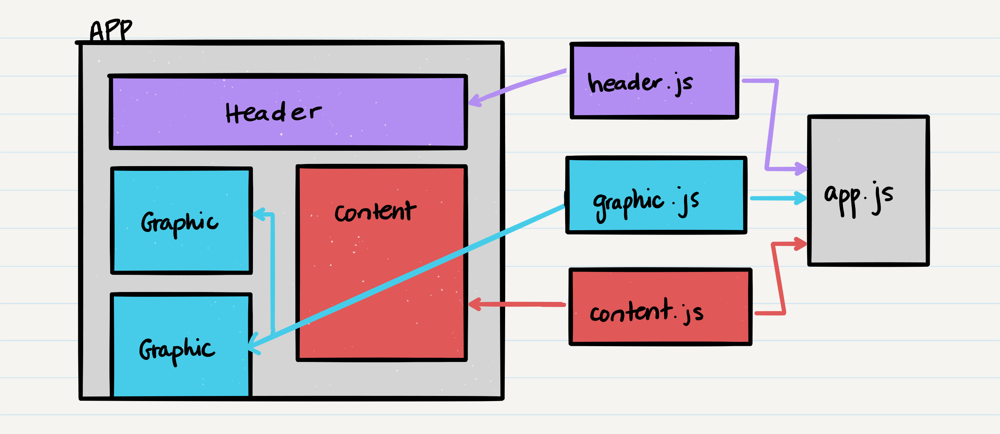
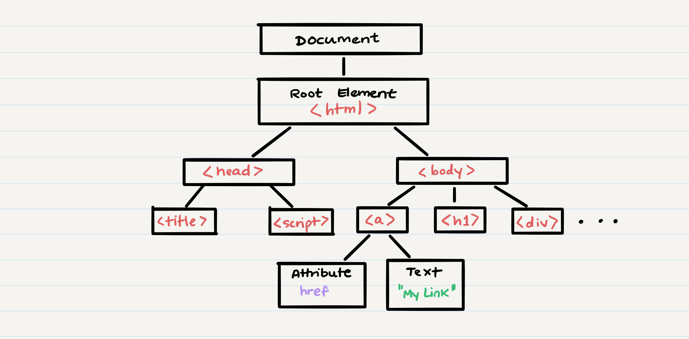

# Class 18 - Component Based UI

| [Lecture Video](https://frontrowviews.com/Home/Event/Details/5d8e9121bdb995374c472823) | [Lab Video](https://frontrowviews.com/Home/Event/Details/5d8e9123bdb995374c47282c) |
| -------------------------------------------------------------------------------------- | ---------------------------------------------------------------------------------- |


## Key Terms

| Term       | Definition                                                                                                                                                                                                                                                                                                                               | Supporting Links                                                                                                                                                                                         |
| ---------- | ---------------------------------------------------------------------------------------------------------------------------------------------------------------------------------------------------------------------------------------------------------------------------------------------------------------------------------------- | -------------------------------------------------------------------------------------------------------------------------------------------------------------------------------------------------------- |
| Components | Components are independent and reusable bits of code. They serve the same purpose as JavaScript functions, but work in isolation and produce HTML code. Components come in two types, class components and functional components.                                                                                                        | [1](https://reactjs.org/docs/components-and-props.html) / [2](https://www.w3schools.com/react/react_components.asp) / [3](https://medium.com/the-andela-way/understanding-react-components-37f841c1f3bb) |
| JSX        | JSX stands for JavaScript XML, and it allows us to write HTML in React.                                                                                                                                                                                                                                                                  | [1](https://reactjs.org/docs/introducing-jsx.html) / [2](https://www.w3schools.com/react/react_jsx.asp)                                                                                                  |
| State      | React class components have a built-in state object, where dynamic properties are stored for that component. When the state object changes, the component re-renders.                                                                                                                                                                    | [1](https://reactjs.org/docs/faq-state.html) / [2](https://reactjs.org/docs/state-and-lifecycle.html) / [3](https://www.w3schools.com/react/react_state.asp)                                             |
| Render     | To render something means to display it on the screen. All react components have some HTML that they want to render. Class components will watch for state changes and re-render (or re-display) the component seamlessly on the web page.                                                                                               | [1](https://reactjs.org/docs/rendering-elements.html) / [2](https://css-tricks.com/an-overview-of-render-props-in-react/)                                                                                |
| DOM        | DOM stands for Document Object Model, and it refers to how HTML pages are stored in memory once they are loaded. The HTML page is morphed into a tree-like structure, and DOM methods allow us to access nodes in that tree.                                                                                                             | [1](https://en.wikipedia.org/wiki/Document_Object_Model) / [2](https://www.w3schools.com/js/js_htmldom.asp) / [3](https://developer.mozilla.org/en-US/docs/Web/API/Document_Object_Model)                |
| Libraries  | A JavaScript library is a collection of code modules or building blocks. For example, JQuery is a library that exposes functions such as `.slideIn()` or `.click()`. React is also a library which has mostly optional features, and it exposes new functionality on JavaScript without major changes to how that JavaScript is written. | [1](https://en.wikipedia.org/wiki/JavaScript_library) / [2](https://www.quora.com/Is-React-a-library-or-a-framework-and-why)                                                                             |
| Frameworks | A JavaScript framework is a collection of rules and structure enforced upon JavaScript code. A framework typically describes the entire application's design, and will only work if the application conforms to that. React can also be considered a framework, though it is more flexible and so is often referred to as a library.     | [1](https://en.wikipedia.org/wiki/JavaScript_framework) / [2](https://www.quora.com/Is-React-a-library-or-a-framework-and-why)                                                                           |

## Key Packages

| Package     | Description                                                                                                                                     | Link                                           |
| ----------- | ----------------------------------------------------------------------------------------------------------------------------------------------- | ---------------------------------------------- |
| `react`     | A JavaScript library for creating user interfaces.                                                                                              | [npm](https://www.npmjs.com/package/react)     |
| `react-dom` | A package that is meant to be paired with the `react` package. This package allows us to use and manipulate the DOM within our JavaScript code. | [npm](https://www.npmjs.com/package/react-dom) |

## Where We're Coming From

So far, we've been spending a lot of time creating web applications without a client-side or front-end. We have learned:

-   How to make classes so that we can define our own object types
-   How to store and read data from a database so that our applications "persist" information
-   How to use an express server to create an API
-   How data is sent over the internet via HTTP and TCP

Now, it's time to shift our focus to the front-end. While you may be familiar with creating websites using HTML files and JQuery-enabled JavaScript files, we're going to dive into a different way of thinking about our websites. We're going to see what it looks like when our HTML and JavaScript is in the same file, and when our web pages are broken up into modular pieces with access to all of our Node modules. And we'll be doing all of this using a library called React.

## Where We're Going

React was created in 2011 by a Facebook engineer, with the goal to improve how UIs were developed for web applications. Originally, making a UI involved long HTML pages that were pretty disjoint from one another. If you had the same Header or NavBar on every page in your application, you'd have to copy-paste that HTML code in every HTML file.

### Components

By using React, we'll be able to create a modular _component_ for that Header or NavBar (or any other piece of UI). This will allow us to have one _JSX_ file defining our component, and any changes we make to that file will propagate throughout our application.

> JSX stands for "JavaScipt XML", and refers to React JavaScript files which allow for JavaScript and HTML to be seamlessly mixed together. The only requirement is that the HTML code is enclosed in parentheses `()`

These modular components can either be classes or functions, and they can maintain a _state_. The state of a component refers to a collection of variables which will trigger a _re-render_ of the component whenever they are changed.

Because the components are modular, they can then be imported and shared around multiple files, and thus your application composition can be neatly defined.



### Rendering

The basic concept of each component is the idea of JavaScript logic and HTML rendering. To "render" a component means to display it, and React will dynamically render components within the _DOM_ of our application.

> DOM stands for "Document Object Model", and refers to how an HTML page is interpreted and stored, so that pieces can be dynamically changed. The DOM of an HTML page will break up the page into a tree structure, as shown below:



With stateful components, a collection of variables can cause parts of the component to be re-rendered. React will smartly handle this so that your application is as fast and efficient as possible.

## How To Get There

Now that we've touched upon some theoretical concepts, let's get our hands into React to really see how it works.

### Creating a React Application

There are two major ways we'll be creating React applications in this class. The first is a simple method via [CodeSandbox](https://codesandbox.io/), and the second is creating your React code locally with a helper module called [`create-react-app`](https://github.com/facebook/create-react-app).

#### CodeSandbox

Many of your React labs will ask you to develop your code via [CodeSandbox](https://codesandbox.io/). This is largely because it speeds up our grading process, and allows your code to easily be shared and tested by anyone.

Navigate to the [CodeSandbox](https://codesandbox.io/) website, and hit "Create Sandbox" in the upper right-hand corner. From the list of options in the following pop-up, choose "React".

> Note: You can also use the "Import" tab on the right-hand side to import code from an existing repository. This is very useful for importing any starter code.

You should now be started with a React project. By clicking the "Signin with Github" button in the top right-hand corner, you can easily save your sandbox and upload it to a git repository. See instructions for how to do that [here](https://codesandbox.io/docs/git).

#### `create-react-app`

To use the `create-react-app` tool, install it globally onto your machine:

```
$ npm install -g create-react-app
```

Next, navigate to the directory you want to create your application in, and run the command `create-react-app <your-app-directory-name>`.

```
$ create-react-app ./my-test-app
```

You can then navigate to the newly created folder, and there you will see existing `node-modules`, `public` and `src` folders, as well as a `README.md` and `package.json`. This is everything you need to have a functioning React application.

To run this application, you can simply use `npm start` and it will attempt to build and launch the application at `http://localhost:3000`. Anytime you change your source code, the application on your localhost should automatically update.

### Getting Started with Code

If you are developing your application using CodeSandbox, you should be given an `index.js` to start with, which should have an `App` component defined. If using `create-react-app`, you will instead be given both an `index.js` and an `App.js`, where `App.js` contains your `App` component.

This `App` component will be primarily what you're adding to; either importing other modular components into this component, or adding functionality to the `App` component itself.

### Creating Your First Component

Let's build a simple introductory component. Our component will render a button which increments a count, and an `h1` level heading which displays the current count. Start by creating a new file called `counter.js`.

Within `counter.js`, we're going to define this component as a class:

```jsx
import React from 'react';

class Counter extends React.Component {
    // class constructor, calling super
    constructor(props) {
        super(props);
        this.state = {
            counter: 0,
        };
    }

    // increments our count
    addCount() {
        this.setState({ counter: this.state.counter + 1 });
    }

    // the HTML that is added to the page for our component
    render() {
        return (
            <div>
                <h1>The current count is: {this.state.counter}</h1>
                <button onClick={this.addCount.bind(this)}>Add to Count</button>
            </div>
        );
    }
}

export default Counter;
```

There are a lot of pieces to tackle in this code. Let's start with the first and last line.

#### React Modules

```jsx
import React from 'react';
```

```jsx
export default Counter;
```

In our CommonJS modules we've been creating, we would define the functions or classes that comprised the module, and then add them to `module.exports`. Then, we would use the `require` keyword to import the module contents into another file.

In React, we have the same concepts of modules, but the syntax is different. Now, in order to import a module into our code, we use the `import` syntax:

```jsx
import x from y;
```

> Here, `x` is the variable name we're going to use to refer to this module. For example, we imported the `'react'` module and set it to a variable named `React`. Likewise, `y` is the path to the file or module we're importing from. Anything in our `/node_modules` folder does not need a direct path.

In order to create a module, we need to ensure that something is exported from our module file. As you can see, in React, we export something using the `export` syntax:

```jsx
export default z;
```

> Here, `z` refers to a single class or function defined in the current file that we're exporting. The `default` keyword means this is what is imported when an `import` command attempts to import the full file.

We can also export multiple items by removing the `default` keyword:

```jsx
export default z;
export a;
export b;
```

We could then import these all, using curly brackets to name items that are not the `default` export (in which case the naming convention has to match).

```jsx
import x, {a, b} from y;
```

> Here, `x` equates to `z` , `a` and `b` equate to `a` and `b` from the source module

Let's move on from importing/exporting to the class definition.

#### Component Class

```jsx
class Counter extends React.Component {
    // class constructor, calling super
    constructor(props) {
        super(props);
        this.state = {
            counter: 0,
        };
    }
```

When creating a component, we can choose to make it either a function or a class. Let's focus on the class implementation first, and move to implementing a functional component [later](#functional-component).

In this class component implementation, we create a class that extends `React.Component`. We then also create a constructor with a parameter called `props`.

"Props" is a React term that refers to any properties that are passed to this component. Remember, these components are essentially HTML elements we're defining, and any HTML element can take inline properties:

```html

<a href="" target=""></a>
<div data-attr="" id=""></div>
```

In the example above, `src`, `href`, `target`, `data-attr`, and `id` are all properties defined on an element. When we create our own components, we can access any inline properties through the `props` object, which turns the properties into key-value pairs. Thus, we can access `this.props.id` to get the `id` inline property.

Any component constructor should pass in `props` as a parameter. Note that React optimizes so that your classes by default don't need a constructor! However, the constructor is where we can initialize any **_state_** variables in our component, so it is often a vital piece to implement.

When implementing a constructor, you _must_ begin the constructor by calling any inherited class constructors using `super(props)`. Then, you can do any component initialization you need to. For example, we set the state variable `counter` equal to zero:

```jsx
this.state = {
    counter: 0,
};
```

Next, let's take a look at our `render` function, usually defined at the end of our component.

#### Render Function

```jsx
// the HTML that is added to the page for our component
render() {
    return (
        <div>
            <h1>The current count is: {this.state.counter}</h1>
            <button onClick={this.addCount.bind(this)}>Add to Count</button>
        </div>
    );
}
```

The render function should return a block of HTML content that will then be added to the DOM whenever this component is referenced. Note that anything you return must be contained within one HTML element. You cannot return sibling elements.

```jsx
// invalid return
return (
    <div>This is invalid</div>
    <div>This is invalid</div>
);
```

```jsx
// valid return
return (
    <div>
        <div>This is valid</div>
        <div>This is valid</div>
    </div>
);
```

Otherwise, there are no strict limitations on what must be returned. It can be any valid HTML, and it can also include other imported components. This is the heart of what makes JSX files and React unique! Seamlessly, we're able to mix JavaScript code and HTML.

#### Using State Variables

In our component code, there are three major area where we use the `state` object. First is when we initialize our state in the constructor:

```jsx
this.state = {
    counter: 0,
};
```

Second is when we change the state in the `addCount` function, using another helper function called `setState`:

```jsx
// increments our count
addCount() {
    this.setState({ counter: this.state.counter + 1 });
}
```

The `setState` function is a function upon the `this` object. It allows us to change the state, and in fact this is the _only proper way_ to change state variables outside a constructor!

> Never use this.state.counter = x outside of your constructor, always use this.setState({ counter: x }). This protects against race conditions and overall ensures your `state` object doesn't change incorrectly

Finally, we actually get the value of our state variable printed in our rendered HTML:

```jsx
// the HTML that is added to the page for our component
render() {
    return (
        <div>
            <h1>The current count is: {this.state.counter}</h1>
```

As you can see, just as we can mix HTML code into JavaScript code using parentheses `()`, we can also mix JavaScript code into HTML code using curly brackets `{}`. To get a state variable `x`, we simply have to call `this.state.x`.

#### Event Handlers

Now that we're back in the realm of UI and HTML, we have access to all of our HTML events such as `onclick`, `onsubmit`, `onchange`. We can attach handlers to these events just like we're used to:

```jsx
<button onClick={this.addCount.bind(this)}>Add to Count</button>
```

Note that all events in React are changed to [camel case](https://en.wikipedia.org/wiki/Camel_case). This means that events like `onclick`, `onsubmit`, `onchange`, etc. will become `onClick`, `onSubmit` and `onChange`.

### Rendering a Component

Now that we've created our simple starting component, how do we get this to show up in our application?

This is where our `App` component comes in. If you're using CodeSandbox, you should have this `App` component defined in `index.js`. Otherwise, using `create-react-app` you should see it defined in `app.js`. Here's an example of a default `App` component:

```jsx
import React from 'react';
import ReactDOM from 'react-dom';
import './styles.css';

function App() {
    return (
        <div className="App">
            <h1>Hello CodeSandbox</h1>
            <h2>Start editing to see some magic happen!</h2>
        </div>
    );
}

const rootElement = document.getElementById('root');
ReactDOM.render(<App />, rootElement);
```

Let's break this down again to see what each individual piece is doing.

#### Imports

In this `App` component, we are importing three items:

```jsx
import React from 'react';
import ReactDOM from 'react-dom';
import './styles.css';
```

The first is our `react` library. The second is a new package called `react-dom`. This allows us to manipulate our DOM in our application, inserting components and dynamically changing or accessing them. Finally, our last import is a CSS stylesheet. React can easily import stylesheets and interpret them, and you can even define CSS code within a `.jsx` file.

#### Functional Component

In our first component example, we defined a class. For our `App` component, however, we can see that it is in fact a function! This function simply returns some HTML code.

```jsx
function App() {
    return (
        <div className="App">
            <h1>Hello CodeSandbox</h1>
            <h2>Start editing to see some magic happen!</h2>
        </div>
    );
}
```

Here's an overview of the major difference between functional components and class components:

| Behavior                 | Functional Implementation                                                                                            | Class Implementation                                                                                                                                                                                 |
| ------------------------ | -------------------------------------------------------------------------------------------------------------------- | ---------------------------------------------------------------------------------------------------------------------------------------------------------------------------------------------------- |
| Render some HTML         | In a functional component, the HTML to render is simply returned by the function                                     | In a class component, the HTML to render is returned by a specific class method called `render()`                                                                                                    |
| Props being passed along | In a functional component, the props can be passed as a parameter to the main function: `function App(props)`        | In a class component, the default constructor passes it along as a parameter: `constructor(props)`                                                                                                   |
| State                    | Functional components do not support state. Because of this, they are often called _stateless_ functional components | Class components can easily initialize states using a constructor, and then access state variable using `this.state` or set them using `this.setState()`                                             |
| Lifecycle Hooks          | Functional components do not support lifecycle hooks                                                                 | Class components can support lifecycle hooks through functions like `componentDidMount`, `componentDidUpdate`, and `componentWillUnmount`. We will learn more about lifecycle hooks in a later class |

The most important difference to note between functional components and class components is that _functional components do not support state_. Because of this, we usually use functional components for small, lightweight code and class components for more complex component logic. In a later class, we'll learn how to bridge the gap between functional and class components.

#### React DOM

Finally, at the end of our component, we do the main magic that causes our application to render something on the screen:

```jsx
const rootElement = document.getElementById('root');
ReactDOM.render(<App />, rootElement);
```

The first line gets a div with an `id` equal to `root`, and the second uses the `react-dom` package to tell the HTML page to render our `App` component within that element. This essentially inserts some HTML and JavaScript logic into our `index.html` file, which can be defined simply like:

```html
<!DOCTYPE html>
<html lang="en">
    <head></head>

    <body>
        <div id="root"></div>
    </body>
</html>
```

As you can see, our `index.html` is just an empty wrapper for all of our application to fit inside. Using `react-dom`, we can bundle our `.jsx` code into HTML and script code, and then insert it into our `index.html`.

#### Adding Our Counter Component

Now that we know what our `App` component is doing, how can we add our `Counter` component into our application? The first step, like with all modules and components, is to import it into `app.js` or `index.js`:

```jsx
import Counter from './counter.js';
```

After our `Counter` component is imported, we can render its HTML by using `<Counter />` within any HTML block. We have one large HTML block as the return value of this function, so that seems like the appropriate place to put it!

```jsx
import React from 'react';
import ReactDOM from 'react-dom';
import './styles.css';
import Counter from './counter.js';

function App() {
    return (
        <div className="App">
            <h1>Hello CodeSandbox</h1>
            <h2>Start editing to see some magic happen!</h2>
            <Counter />
        </div>
    );
}

const rootElement = document.getElementById('root');
ReactDOM.render(<App />, rootElement);
```

And that's it! We now have imported our custom component and then called it within our HTML code. This will cause React to call the `render()` function in our `Counter` class, and then paste the HTML result into the body of the `App` component.

With that, we've made our first independent component and used it in our application!
