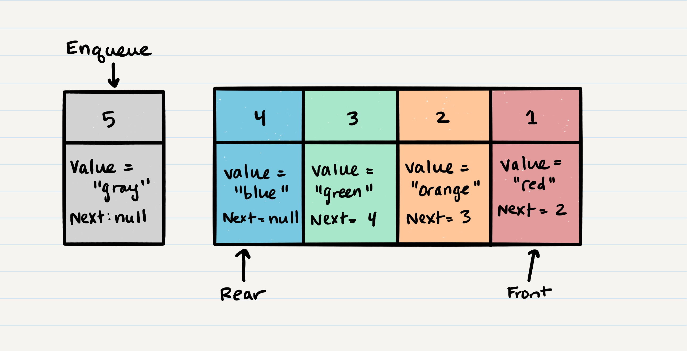
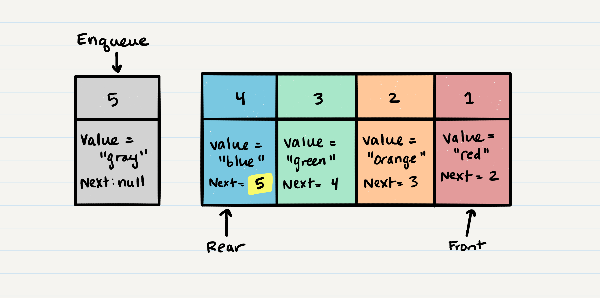

# Stacks and Queues

## What is a Stack

A stack is a data structure that consists of `Nodes`. Each `Node` references the next Node in the stack, but does not reference its previous.

Common terminology for a stack is

1. _Push_ - Nodes or items that are put into the stack are _pushed_
2. _Pop_ - Nodes or items that are removed from the stack are _popped_
3. _Top_ - This is the top of the stack.
4. _Peek_ - When you `peek` you will view the `top` Node in the stack. If the stack is empty, and you don't `peek`, you will receive a `NullReferenceException` if you attempt to `pop`.

Stacks follow these concepts:

### FILO

**F**irst
**I**n
**L**ast
**O**ut

This means that the first item added in the stack will be the last item popped out of the stack.

### LIFO

**L**ast
**I**n
**F**irst
**O**ut

This means that the last item added to the stack will be the first item popped out of the stack.

### Stack Visualization

Here's an example of what a stack looks like. As you can see, the topmost item is denoted as the `top`. When you push something to the stack, it becomes the new `top`. When you pop something from the stack, you pop the current `top` and set the next `top` as `top.next`.


### Push O(1)

Pushing a Node onto a stack will always be an `O(1)` operation. This is because it takes the same amount of time no matter how many Nodes (`n`) you have in the stack.

When adding a Node, you `push` it into the stack by assigning it as the new top, with it's `next` property equal to the original/old `top`.

Let's walk through the steps:

1. First, you should have the Node that you want to add. Here is an example of a Node that we want to add to the stack.


2. Next, you need to assign the `next` property of `Node 5` to reference the same Node that `top` is referencing: `Node 4`


3. Technically at this point, your new Node is added to your stack,
   but there is no indication that it is the first Node in the stack.
   To make this happen, you have to re-assign our reference `top` to the newly added Node, `Node 5`.


4. Congratulations! You completed a successful `push` of `Node 5` onto the stack.

Here is the pseudo code to `push` a Node onto a stack:

```javascript
ALOGORITHM push(node)
// INPUT <-- node to add
// OUTPUT <-- none

   Node.next <-- Top
   top <-- Node

```

### Pop O(1)

Popping a Node off a stack is the action of removing a Node from the top.
When conducting a `pop`, the `top` Node will be re-assigned to the Node
that lives below and the `top` Node is returned to the user.

Let's try and `pop` off `Node 5` from the stack. Here is a visual of the current state of our stack:


1. The first step of removing `Node 5` from the stack is to create a reference named `temp` that points to the same Node that `top` points to.


2. Once you have created the new reference type, you now need to re-assign `top` to the value that the `next` property is referencing. In our visual, we can see that the `next` property is pointing to `Node 4`. We will re-assign `top` to be `Node 4`.


3. We can now remove `Node 5` safely without it affecting the rest of the stack. Before we do that though you may want to make sure that you clear out the `next` property in your current `temp` reference. This will ensure that no further references to `Node 4` are floating around the heap. This will allow our garbage collector to cleanly and safely dispose of the Nodes correctly.


4. Finally, we return the `temp` Node that was just popped off.

Here is the pseudo code for a `pop`

```javascript
ALGORITHM pop()
// INPUT <-- No input
// OUTPUT <-- top Node of stack

   Node temp <-- top
   top <-- top.next
   temp.next <-- null
   return temp
```

### Peek O(1)

When conducting a `Peek`, you will only be viewing the `Top` Node of the stack.
Traditionally, you always want to `Peek` before conducting a `Pop`. This will ensure
that you do not receive a `NullExceptionError` on your `Pop` action.

Here is the Pseudo code for a `Peek`

```javascript

ALGORITHM Peek()
// INPUT <-- none
// OUTPUT <-- Node of top of stack

   return Top

```

We do not re-assign the `Next` property when we `Peek` because we want to keep the reference
to the next Node in the stack. This will allow the `Top` to stay the top until we decide to `Pop`

## What is a Queue

Common terminology for a queue is

1. _Enqueue_ - Nodes or items that are added to the queue.
2. _Dequeue_ - Nodes or items that are removed from the queue.
3. _Front_ - This is the front/first Node of the queue.
4. _Rear_ - This is the rear/last Node of the queue.
5. _Peek_ - When you `Peek` you will view the `Top` Node in the stack. If the stack is empty,
   and you don't `Peek`, you will receive a `NullReferenceException`.

Queues follow these concepts:

1. **FIFO** - **F**irst **I**n **F**irst **O**ut - This means that the first item in the queue will be the first item out of the queue.
2. **LILO** - **L**ast **In** **L**ast **O**ut - This means that the last item in the queue will be the last item out of the queue.

Here is what a `Queue` looks like:

{:target="\_blank"}

### Enqueue O(1)

When you add an item to a queue, you use the `Enqueue` action. This is done with an O(1) operation in time because
it does not matter how many other items live in the queue, it takes the same amount of time to perform the operation.

Let's walk through the process of adding a Node to a queue:

{:target="\_blank"}

1. First, we should change the `Next` property of `Node5` to point to the Node
   we are adding. In our case with the visual below, we will be re-assigning `Node5.Next` to `Node6`.

The only way we have access to `Node5` is through our reference type `Rear`. Following the rules of reference types,
this means that we must change `Rear.Next` to `Node6`.

{:target="\_blank"}

2. After we have set the `Next` property, we can re-assign the `Rear` reference to point to `Node6`.
   By doing this, it allows us to keep a reference of where the `Rear` is, and we can continue to `Enqueue`
   Nodes into the queue as needed.

{:target="\_blank"}

3. Congratulations! You have just successfully added a Node to a queue by activating the `Enqueue` action.

#### Code

Here is the pseudo code for the `Enqueue` method:

```javascript
ALGORITHM Enqueue(Node)
// INPUT <-- Node to add to queue
// OUTPUT <-- none

   Rear.Next <-- Node
   Rear <-- Node

```

### Dequeue O(1)

When you remove an item from a queue, you use the `Dequeue` action. This is done with an O(1) operation in time because
it doesn't matter how many other items are in the queue, you are still always removing the `Front` Node of the queue.

Let's walk through the process of removing a Node from a queue.

1. The first thing you want to do create a temporary reference type named `Temp` and have it point to the same Node
   that `Front` is pointing too. This means that `Temp` will point to `Node1`

{:target="\_blank"}

2. Next, you want to re-assign `Front` to the `Next` value that the Node `Front` is referencing. In our visual, this would
   be `Node2`.

{:target="\_blank"}

3. Now that we have moved `Front` to the second Node in line, we can next re-assign the `Next` property on the `Temp` Node to null.
   We do this because we want to make sure that all the proper Nodes clear any unnecessary references for the garbage collector to come in
   later and clean up.

{:target="\_blank"}

4. Congratulations! You have just successfully completed a `Dequeue` action on a queue!

{:target="\_blank"}

#### Code

Here is the Pseudo Code for the `Dequeue` method:

```javascript
ALGORITHM Dequeue()

   Node temp <-- Front
   Front <-- Front.Next
   temp.Next <-- null

   return temp;
```

### Peek O(1)

When conducting a `Peek`, you will only be viewing the `Front` Node of the stack.
Traditionally, you always want to `Peek` before conducting a `Dequeue`. This will ensure
that you do not receive a `NullExceptionError` on your `Dequeue` action.

#### Code

Here is the pseudo code for a `Peek`

```javascript
ALGORITHM Peek()

   return Front
```

We do not re-assign the `Next` property when we `Peek` because we want to keep the reference
to the next Node in the queue. This will allow the `Front` to stay in the front until we decide to `Dequeue`

### Prerequisites

You should include a requirement in both your `Stack` and `Queue` class to
guarantee that you have at least one Node starting out. Don't forget to assign the proper
properties to the correct locations in both the stack and the queue.
