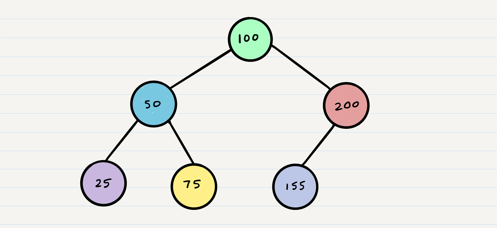
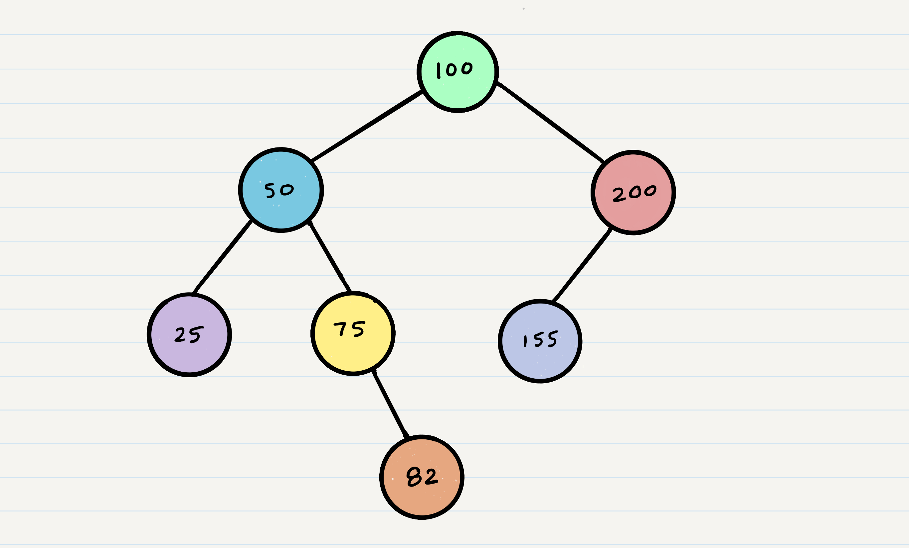

# Code Challenge 13 - Trees

## Specifications

-   Read all of these instructions carefully. Name things exactly as described.
-   Do all your work in a public repository (matching the example provided by your instructor) called `data-structures-and-algorithms`, with a well-formatted, detailed top-level `README.md`
    -   Your top-level `README` should contain a "Table of Contents" navigation to all of your challenges and implementations so far. (Don't forget to update it!)
-   On your branch, create a folder named `tree` which contains a file called `tree.js`
-   Include any language-specific configuration files required for this challenge to become an individual component, module, library, etc.
    -   _NOTE: You can find an example of this configuration for your course in your class lecture repository._

## Features

### Node Class

Create a `Node` class that has properties for the `value` stored in the node, the `left` child `Node`, and the `right` child `Node`.

### Binary Tree

Create a `BinaryTree` class with the following defined properties and methods:

-   A `root` property that stores a `Node` representing the start of the tree
-   A `preOrder` method that traverses the tree using the pattern `root >> left >> right` and returns an array of the traversed values
-   An `inOrder` method that traverses the tree using the pattern `left >> root >> right` and returns an array of the traversed values
-   A `postOrder` method that traverses the tree using the pattern `left >> right >> root` and returns an array of the traversed values

#### Example

Given the following tree:


You should return the following values:

| Function      | Return Value         |
| ------------- | -------------------- |
| `preOrder()`  | `[A, B, D, E, C, F]` |
| `inOrder()`   | `[D, B, E, A, F, C]` |
| `postOrder()` | `[D, E, B, F, C, A]` |

### Binary Search Tree

Create a `BinarySearchTree` class, extended from your `BinaryTree` class, with the following defined properties and methods:

-   An `add` method that accepts a value and adds a new `Node` with that value in the correct location in the binary search tree.
-   A method named `contains` that accepts a value, and returns a boolean indicating whether or not the value is in the tree at least once.

Any exceptions or errors that come from your code should be semantic, captured errors. For example, rather than a default error thrown, your code should raise/throw a custom, semantic error that describes what went wrong in calling the methods you wrote for this lab.

#### Example

Given the following tree:



Calling `add(82)` should result in the following tree:



## Structure and Testing

Utilize the Single-responsibility principle: any methods you write should be clean, reusable, abstract component parts to the whole challenge. You will be given feedback and marked down if you attempt to define a large, complex algorithm in one function definition.

Write tests to prove the following functionality:

1. Can successfully instantiate an empty tree
2. Can successfully instantiate a tree with a single root node
3. Can successfully return a collection from a pre-order traversal
4. Can successfully return a collection from an in-order traversal
5. Can successfully return a collection from a post-order traversal
6. Can successfully add a left child and right child to a single root node on a Binary Search Tree

Ensure your tests are passing before you submit your solution.

**You must have Travis connected to your pull request in order to get full points on testing!**

## Documentation: Your README.md

```markdown
# Trees

<!-- Short summary or background information -->

## Challenge

<!-- Description of the challenge -->

## Approach & Efficiency

<!-- What approach did you take? Why? What is the Big O space/time for this approach? -->

## API

<!-- Description of each method publicly available in each of your trees -->
```

## Submission Instructions

1. Create a pull request from your branch to your `master` branch
1. In your open pull request, leave as a comment [a checklist](https://github.com/blog/1825-task-lists-in-all-markdown-documents) of the specifications and tasks above, with the actual steps that you completed checked off
1. Submitting your completed work to Canvas:
    1. Copy the link to your challenge `README` (which must have a link to your pull request inside of it) and paste it into the corresponding Canvas assignment
    1. Leave a description of how long this assignment took you in the comments box
    1. Add any additional comments you like about your process or any difficulties you may have had with the assignment
1. **Do NOT merge your branch into `master` - your open pull request will be your primary way to resubmit if needed. Only merge to master once you have received a grade and do not wish to resubmit.**
