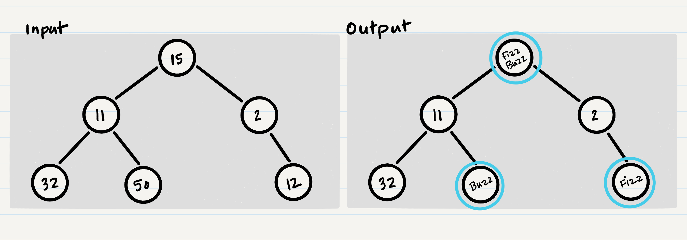

# Code Challenge 16

Conduct "FizzBuzz" on a tree while traversing through it. Change the values of each of the nodes dependent on the current node's value

## Specifications

-   Read all of these instructions carefully. Name things exactly as described.
-   Do all your work in a public repository called `data-structures-and-algorithms`, with a well-formatted, detailed top-level `README.md`.
    -   This assignment should be completed within the `challenges` subdirectory of the repository.
    -   Your top-level README should contain a "Table of Contents" navigation to all of your challenges and implementations so far. (Don't forget to update it!)
-   Create a new branch in your repo called `fizzbuzz-tree`.
-   On your branch, create a folder named `fizzBuzzTree` which contains a file called `fizz-buzz-tree.js`
-   Include any language-specific configuration files required for this challenge to become an individual component, module, library, etc.
    -   _NOTE: You can find an example of this configuration for your course in your class lecture repository._

## Feature Tasks

-   Write a function called `FizzBuzzTree` which takes a tree's root Node as an argument.
-   This tree can be any binary tree with number values on its Nodes
-   Without utilizing any built-in methods available in JavaScript,
    determine whether or not the value of each Node is divisible by 3 and/or 5 and change the value of each of the nodes:
    -   If the value is divisible by 3, replace the value with "Fizz"
    -   If the value is divisible by 5, replace the value with "Buzz"
    -   If the value is divisible by 3 and 5, replace the value with "FizzBuzz"
-   Return the tree with its new values.

### Example



## Requirements

### Whiteboard

For this challenge, you will be required to create a whiteboard diagram showing how your algorithm works. Refer to the [whiteboarding example](../DataStructuresWhiteboard.PNG) for guidance

### Testing

Write tests for the following (note that some tests can be combined):

-   Incorrect parameter
-   Tree with only one Node
-   Tree with root and only one left child
-   Tree with no values divisible by 3 or 5
-   Tree with values divisible by 3, by 5 and by both 3 and 5

**You must have Travis connected to your pull request in order to get full points on testing!**

## Documentation: Your README.md

```markdown
# FizzBuzz Tree

## Links

-   Link to Pull Request
-   Link to Travis

<!-- Short summary or background information -->

## Whiteboard

<!-- Photo of your whiteboard -->

## Challenge

<!-- Description of the challenge -->

## Approach & Efficiency

<!-- What approach did you take? Why? What is the Big O space/time for this approach? -->

## API

<!-- Description of each method publicly available in your implementation -->
```

## Submission Instructions

1. Create a pull request from your branch to your `master` branch
2. In your open pull request, leave as a comment [a checklist](https://github.com/blog/1825-task-lists-in-all-markdown-documents) of the specifications and tasks above, with the actual steps that you completed checked off. Include in that checklist the following items:

```markdown
-   [ ] Top-level README “Table of Contents” is updated
-   [ ] Feature tasks for this challenge are completed
-   [ ] Unit tests written and passing
    -   [ ] Travis is correctly connected to this pull request
    -   [ ] Travis shows green passing
-   [ ] README for this challenge is complete
    -   [ ] Summary, Description, Approach & Efficiency, Solution
    -   [ ] Link to code
    -   [ ] Picture of whiteboard
```

3. Submitting your completed work to Canvas:
    1. Copy the link to your `README` (which must have a link to your pull request inside of it) and paste it into the corresponding Canvas assignment
    1. Leave a description of how long this assignment took you in the comments box
    1. Add any additional comments you like about your process or any difficulties you may have had with the assignment
4. **Do NOT merge your branch into `master` - your open pull request will be your primary way to resubmit if needed. Only merge to master once you have received a grade and do not wish to resubmit.**
