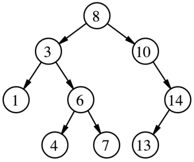

# Interview 1

Sum of numbers in a binary tree

## Specifications

- Read all of the following instructions carefully.
- Act as an interviewer, giving a candidate a code challenge
- Score the candidate according to the [Whiteboard Rubric](https://docs.google.com/spreadsheets/d/1scthkmARfzAFZrSYAp6LA2coOaoWUWbSzMbtIU4jcHw){:target="_blank"}
- You are free to offer suggestions or guidance (and see how they respond),  but don't solve it for the candidate

## Feature Tasks

- Describe to the candidate the following problem:

```
Find the sum of all the odd numbers in a binary search tree. 
```

- Any of the traversals (depth or breadth) will work for this 
  
## Structure

Familiarize yourself with the grading rubric, so you know how to score the interview.

Look for effective problem solving, efficient use of time, and effective communication with the whiteboard space available.

Every solution might look a little different, but the candidate should be able to test their solution with different inputs to verify correctness.

Assign points for each item on the Rubric, according to how well the candidate executed on that skill.

Add up all the points at the end, and record the total at the bottom of the page.

## Example
Considering the following Tree:




Output: 24


## Documentation

Record detailed notes on the rubric, to share with the candidate when the interview is complete.
