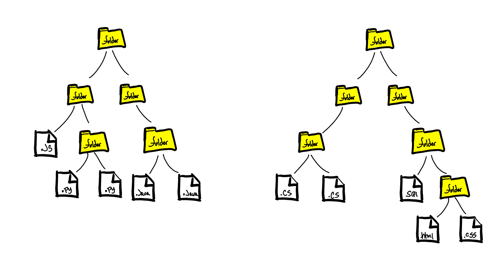
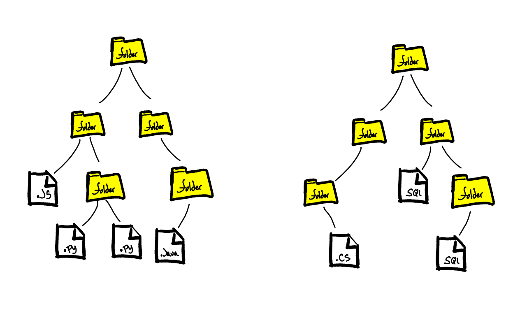

# Interview 02

## Specifications

-   Read all of the following instructions carefully.
-   Act as an interviewer, giving a candidate a code challenge
-   Score the candidate according to the [Whiteboard Rubric](https://docs.google.com/spreadsheets/d/1scthkmARfzAFZrSYAp6LA2coOaoWUWbSzMbtIU4jcHw)
-   You are free to offer suggestions or guidance (and see how they respond), but don't solve it for the candidate

## Feature Tasks

Ask the Candidate the following question:

You are working with a tree file structure where each node has at most two children, representing either files or folders or some mix of the two. Any node that is a folder must have at least one file as a child (no empty folders).

Write a function that takes in two trees representing file structures. Return **true** if both contain the same number of files, or **false** if they do not.

**The following will come back as true:**

Both trees contain 5 files.

**The following will come back as false:**

The first tree has 4 files, while the second only has 3.

> > Hint: Think of files as being leaf nodes

## Structure

Familiarize yourself with the grading rubric, so you know how to score the interview.

Look for effective problem solving, efficient use of time, and effective communication with the whiteboard space available.

Every solution might look a little different, but the candidate should be able to test their solution with different inputs to verify correctness.

Assign points for each item on the Rubric, according to how well the candidate executed on that skill.

Add up all the points at the end, and record the total at the bottom of the page.

## Documentation

Record detailed notes on the rubric, to share with the candidate when the interview is complete.
