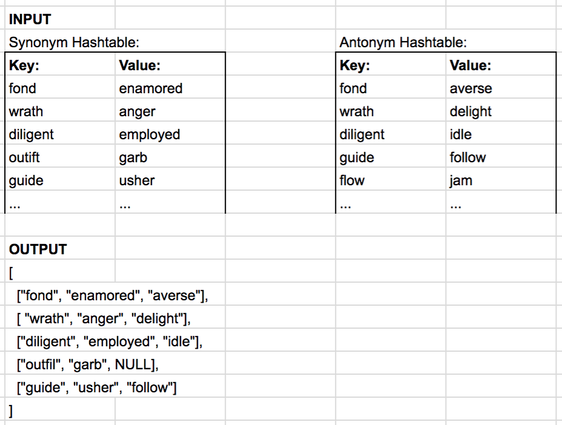

# Code Challenge 28

In this code challenge, you will be writing a function that combines two hash tables using the left join process.

## Specifications

-   Read all of the following instructions carefully. Name things exactly as described.
-   Do all your work in a public repository called `data-structures-and-algorithms`, with a well-formatted, detailed top-level `README.md`
    -   Your top-level `README` should contain a "Table of Contents" navigation to all of your challenges and implementations so far. (Don't forget to update it!)
-   Create a branch in your repository called `left-join`
-   On your branch, create a folder named `leftJoin` which contains a file called `left-join.js`
-   Include any language-specific configuration files required for this challenge to become an individual component, module, library, etc.
    -   _NOTE: You can find an example of this configuration for your course in your class lecture repository._

## Feature Tasks

-   Write a function that [LEFT JOINs](https://www.tutorialspoint.com/sql/sql-left-joins.htm) two hash tables into a single data structure
    -   Assume you know the hash function (use an existing one you've developed before)
    -   The first parameter is a hash table that stores an object containing the original key (a word) and the key's value (a word that is a synonym)
    -   The second parameter is a hash table that stores an object containing the original key (a word), and a key's value (a word that is an antonym)
-   Combine the key and corresponding values (if they exist) into a new data structure according to LEFT JOIN logic.
-   LEFT JOIN means all the values in the first "left" hash table are returned, and if values exist in the "right" hash table, they are appended to the result row. If no values exist in the "right" hashmap, then some flavor of `NULL` should be appended to the result row.
-   The returned data structure that holds the results is up to you. It doesn't need to exactly match the output below, so long as it achieves the LEFT JOIN logic
-   Avoid utilizing any of the library methods available to your language

## Example



## Requirements

### Whiteboard / Drawing

For this challenge, you will be required to create a whiteboard diagram showing how your algorithm works. Refer to the [whiteboarding example](../DataStructuresWhiteboard.PNG) for guidance.

### Testing

Write tests for the following (note that some tests can be combined):

-   Two empty hash tables
-   Two hash tables with no shared keys
-   Hash table where
    -   "left" table has a null value where "right" table does
    -   "right" table has a null value where "left" does
-   Hash tables of varying sizes
    -   "left" table is smaller than the "right" table
    -   "right" table is smaller than the "left" table
-   Hash table with same sizes
-   Hash table with collision

**You must have Travis connected to your pull request in order to get full points on testing!**

## Documentation: Your README.md

```markdown
# Left Join Hash Tables

## Links

-   Link to Pull Request
-   Link to Travis

<!-- Short summary or background information -->

## Whiteboard / Drawing

<!-- Photo of your whiteboard or drawing -->

## Challenge

<!-- Description of the challenge -->

## Approach & Efficiency

<!-- What approach did you take? Why? What is the Big O space/time for this approach? -->

## API

<!-- Description of each method publicly available in your implementation -->
```

## Submission Instructions

1. Create a pull request from your branch to your `master` branch
2. In your open pull request, leave as a comment [a checklist](https://github.com/blog/1825-task-lists-in-all-markdown-documents) of the specifications and tasks above, with the actual steps that you completed checked off. Include in that checklist the following items:

```markdown
-   [ ] Top-level README “Table of Contents” is updated
-   [ ] Feature tasks for this challenge are completed
-   [ ] Unit tests written and passing
    -   [ ] Travis is correctly connected to this pull request
    -   [ ] Travis shows green passing
-   [ ] README for this challenge is complete
    -   [ ] Summary, Description, Approach & Efficiency, Solution
    -   [ ] Link to code
    -   [ ] Picture of whiteboard / drawing
```

3. Submitting your completed work to Canvas:
    1. Copy the link to your `README` (which must have a link to your pull request inside of it) and paste it into the corresponding Canvas assignment
    1. Leave a description of how long this assignment took you in the comments box
    1. Add any additional comments you like about your process or any difficulties you may have had with the assignment
4. **Do NOT merge your branch into `master` - your open pull request will be your primary way to resubmit if needed. Only merge to master once you have received a grade and do not wish to resubmit.**
